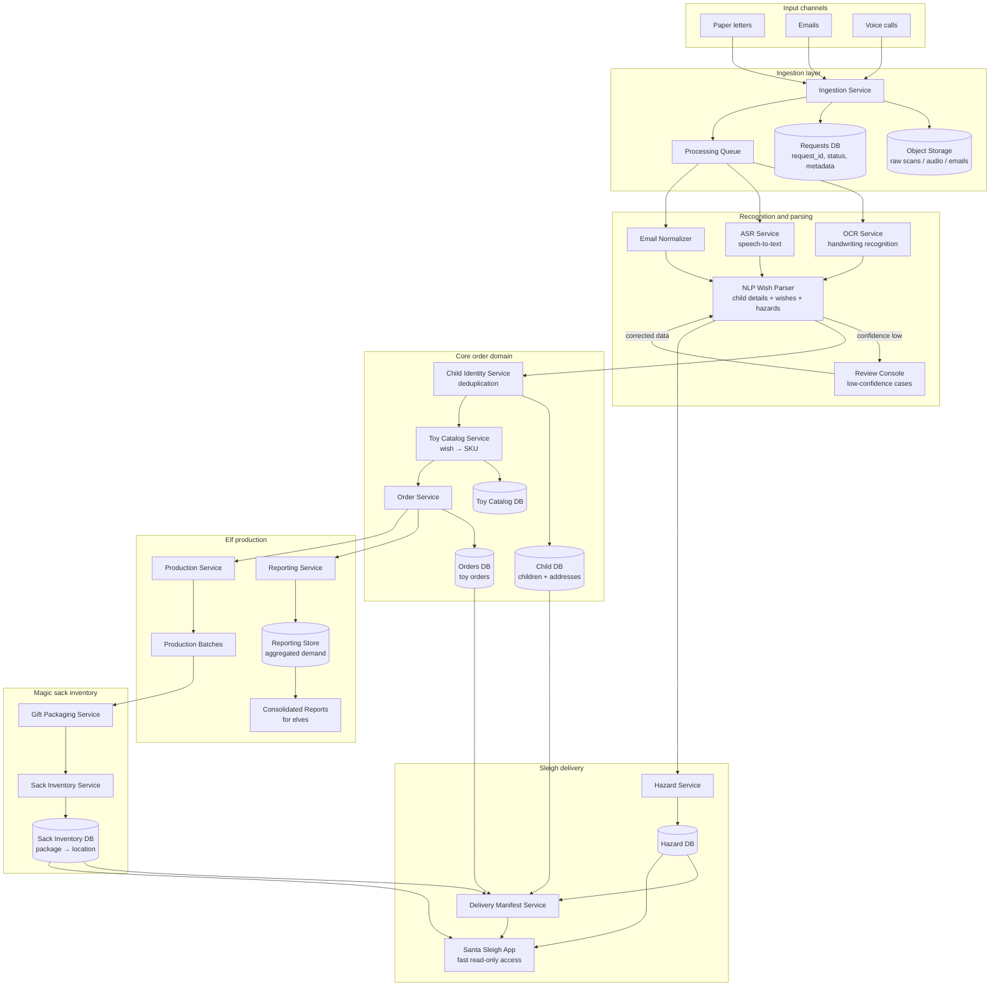

# Santa's Workshop Order Processing System

## Содержание

- [1. Задача](#1-задача)
- [2. Scope Refinement](#2-scope-refinement)
- [3. Assumptions](#3-assumptions)
- [4. Functional Requirements](#4-functional-requirements)
- [5. Non-Functional Requirements](#5-non-functional-requirements)
- [6. Основные сущности](#6-основные-сущности)
- [7. High-Level Architecture](#7-high-level-architecture)
- [8. Основные сервисы](#8-основные-сервисы)
- [9. Ключевые сценарии](#9-ключевые-сценарии)
- [10. Хранилища данных](#10-хранилища-данных)
- [11. Consolidated Reports для эльфов](#11-consolidated-reports-для-эльфов)
- [12. Magic Sack Inventory](#12-magic-sack-inventory)
- [13. Sleigh Delivery System](#13-sleigh-delivery-system)
- [14. Расчёт нагрузки](#14-расчёт-нагрузки)
- [15. Надёжность и обработка ошибок](#15-надёжность-и-обработка-ошибок)
- [16. MVP / MVP+ / Later](#16-mvp--mvp--later)
- [17. Итоговое решение](#17-итоговое-решение)

---

## 1. Задача

Santa получает миллионы запросов на подарки через разные каналы:

- бумажные письма с плохим почерком;
- email;
- голосовые звонки.

Система должна распознать пожелания ребёнка, превратить их в toy orders, объединить заказы в производственные отчёты для эльфов, положить готовые подарки в magic storeroom sack и сохранить точное место каждого подарка.

Во время доставки Santa должен быстро получить:

- адрес дома;
- список детей в доме;
- какие подарки нужно доставить;
- где эти подарки лежат в sack;
- какие hazards есть при доставке.

Главный приоритет системы — speed + accuracy. Ошибка в заказе или доставке напрямую приводит к тому, что ребёнок может получить не тот подарок.

---

## 2. Scope Refinement

| Зона системы | Входит в scope | Не входит в scope | Причина |
|---|---|---|---|
| Input processing | Письма, email, voice calls | Соцсети, мессенджеры, видеообращения | В задаче явно указаны только три канала |
| Handwriting recognition | OCR + confidence score + human review | Идеальное распознавание любого почерка | Плохой почерк требует fallback-процесса |
| Voice processing | ASR + извлечение пожеланий | Распознавание эмоций ребёнка | Не критично для первого релиза |
| Order generation | Нормализация wish → toy SKU | Полностью автоматическое создание новых игрушек | Эльфам нужен понятный производственный заказ |
| Reporting | Агрегированные отчёты по игрушкам | Финансовые отчёты, payroll эльфов | Основная цель — производство подарков |
| Sack inventory | Запись location подарка в sack | Физическая оптимизация магического пространства | Нужна точная адресация, а не модель физики sack |
| Sleigh delivery | Delivery manifest + hazards | Полная навигационная система уровня Google Maps | Santa уже имеет быстрые сани, нужен delivery data layer |
| Hazard tracking | Хранение и показ рисков | Автоматическое устранение hazards | Система только предупреждает Santa |

---

## 3. Assumptions

| Допущение | Значение | Почему это важно |
|---|---:|---|
| Количество детских запросов в год | 100 000 000 | Нужна оценка нагрузки на ingestion pipeline |
| Пиковый период | последние 30 дней до Christmas Eve | Большая часть писем приходит ближе к празднику |
| Доля бумажных писем | 60% | Самый сложный канал из-за OCR |
| Доля email | 30% | Самый дешёвый и структурированный канал |
| Доля voice calls | 10% | Требует ASR и больше compute |
| Среднее число пожеланий в одном запросе | 3 | Один ребёнок может попросить несколько подарков |
| Средний размер raw letter scan | 2 MB | Нужно для оценки storage |
| Средний размер voice call | 3 MB | Нужно для оценки storage |
| Минимальный confidence для auto-processing | 0.90 | Ниже этого нужен human / elf review |
| Минимальный confidence для order creation | 0.95 | Ошибка на этом этапе дороже, чем задержка |

---

## 4. Functional Requirements

| ID | Requirement | Priority | Комментарий |
|---|---|---|---|
| FR-1 | Система должна принимать бумажные письма, email и voice calls | P0 | Базовый входной поток |
| FR-2 | Система должна распознавать текст из письма через OCR | P0 | Критично из-за плохого почерка |
| FR-3 | Система должна переводить voice call в текст через ASR | P0 | Нужна поддержка голосового канала |
| FR-4 | Система должна извлекать child details: имя, адрес, возраст, wish list | P0 | Без этого нельзя собрать заказ |
| FR-5 | Система должна нормализовать пожелания в toy SKU | P0 | Эльфам нужны производственные единицы |
| FR-6 | Система должна дедуплицировать запросы от одного ребёнка | P0 | Ребёнок может отправить письмо и email |
| FR-7 | Система должна создавать toy order по каждому ребёнку | P0 | Основная бизнес-сущность |
| FR-8 | Система должна формировать consolidated reports по игрушкам | P0 | Эльфы должны знать количество каждого типа |
| FR-9 | Система должна сохранять sack location для каждого подарка | P0 | Santa должен быстро найти подарок |
| FR-10 | Система должна формировать delivery manifest для каждого дома | P0 | Нужен список подарков на доставку |
| FR-11 | Система должна показывать delivery hazards | P1 | Повышает безопасность и точность доставки |
| FR-12 | Система должна отправлять low-confidence cases на ручную проверку | P1 | Защита от ошибок OCR / ASR |
| FR-13 | Система должна поддерживать audit trail по каждому заказу | P1 | Можно понять, откуда взялся заказ |
| FR-14 | Система должна поддерживать late changes до cutoff time | P2 | Дети могут менять пожелания |
| FR-15 | Система должна показывать статус заказа | P2 | Полезно для Santa Ops team |

---

## 5. Non-Functional Requirements

| Категория | Requirement | Метрика |
|---|---|---|
| Availability | Ingestion и order processing должны работать в пиковый сезон | 99.95% за последние 30 дней до Christmas Eve |
| Latency | Email должен попадать в processing queue быстро | p95 < 5 секунд |
| Latency | OCR / ASR результат должен появляться за разумное время | p95 < 2 минуты |
| Accuracy | Auto-created order должен быть достаточно точным | ≥ 99.5% после review pipeline |
| Accuracy | Для low-confidence input нужен manual review | confidence < 0.90 |
| Scalability | Система должна выдерживать сезонный пик | до 10x от среднего daily traffic |
| Consistency | Подарок не должен быть доставлен дважды | exactly-once delivery marking |
| Durability | Raw input и orders не должны теряться | replication + backup |
| Observability | Для каждого заказа должен быть trace | request_id / child_id / order_id |
| Security | Данные детей должны быть защищены | encryption at rest + access control |
| Performance | Поиск подарка в sack должен быть мгновенным | p99 < 50 ms |
| Reporting | Отчёт для эльфов должен обновляться регулярно | hourly в пиковый сезон |

---

## 6. Основные сущности

| Entity | Описание | Основные поля |
|---|---|---|
| `RawRequest` | Исходное письмо, email или звонок | request_id, channel, raw_uri, received_at, status |
| `ParsedRequest` | Распознанный текст и confidence | request_id, text, language, confidence |
| `ChildProfile` | Информация о ребёнке | child_id, name, age, address_id, guardians_optional |
| `Wish` | Одно пожелание ребёнка | wish_id, child_id, raw_text, normalized_text |
| `ToySKU` | Каталожная игрушка | sku_id, name, category, production_complexity |
| `ToyOrder` | Производственный заказ | order_id, child_id, sku_id, quantity, status |
| `ProductionBatch` | Партия для эльфов | batch_id, sku_id, quantity, due_date |
| `GiftPackage` | Конкретный собранный подарок | package_id, order_id, sku_id, label |
| `SackLocation` | Место подарка в magic sack | package_id, zone, shelf, slot, magic_index |
| `DeliveryStop` | Один дом на маршруте | stop_id, address_id, child_ids, route_order |
| `Hazard` | Риск при доставке | hazard_id, address_id, type, severity, note |

---

## 7. High-Level Architecture



---

## 8. Основные сервисы

| Service | Ответственность | Почему отдельно |
|---|---|---|
| Ingestion Service | Принимает input из разных каналов | Каналы разные, но дальше нужен единый pipeline |
| OCR Service | Распознаёт бумажные письма | Нужен отдельный compute-heavy сервис |
| ASR Service | Переводит звонки в текст | Voice processing отличается от OCR |
| NLP Wish Parser | Извлекает имя, адрес, wishes, hazards | Центр смысловой обработки |
| Child Identity Service | Склеивает дубликаты по ребёнку и адресу | Один ребёнок может написать несколько раз |
| Toy Catalog Service | Маппит wish на SKU | Производство работает через каталог |
| Order Service | Создаёт и обновляет toy orders | Главная бизнес-логика |
| Review Service | Показывает uncertain cases эльфам-операторам | Нужен human-in-the-loop |
| Reporting Service | Делает consolidated reports | Эльфам нужны агрегаты по SKU |
| Production Service | Передаёт партии в мастерские | Отделяет demand от production |
| Sack Inventory Service | Хранит location каждого gift package | Критично для быстрой доставки |
| Sleigh Delivery Service | Формирует delivery manifest | Santa нужен быстрый read-only доступ |
| Hazard Service | Хранит и отдаёт риски по адресу | Отдельная доменная сущность |

---

## 9. Ключевые сценарии

### 9.1 Paper Letter → Toy Order

| Step | Действие                                    | Результат                         |
| ---- | ------------------------------------------- | --------------------------------- |
| 1    | Letter сканируется                          | Создаётся `RawRequest`            |
| 2    | OCR распознаёт текст                        | Создаётся `ParsedRequest`         |
| 3    | NLP Parser извлекает child details и wishes | Создаются `ChildProfile` и `Wish` |
| 4    | Toy Catalog сопоставляет wish с SKU         | Получаем `sku_id`                 |
| 5    | Order Service создаёт заказ                 | Создаётся `ToyOrder`              |
| 6    | Если confidence низкий                      | Запрос уходит в `ReviewQueue`     |

### 9.2 Email → Toy Order

| Step | Действие | Результат |
|---|---|---|
| 1 | Email попадает в Ingestion Service | Создаётся `RawRequest` |
| 2 | Текст email нормализуется | Удаляются подписи, мусор, вложения |
| 3 | NLP Parser извлекает wishes | Создаются `Wish` |
| 4 | Identity Service ищет existing child | Защита от дублей |
| 5 | Order Service создаёт или обновляет order | Актуальный `ToyOrder` |

### 9.3 Voice Call → Toy Order

| Step | Действие | Результат |
|---|---|---|
| 1 | Call записывается | Создаётся `RawRequest` |
| 2 | ASR переводит речь в текст | Создаётся `ParsedRequest` |
| 3 | NLP Parser извлекает wishes | Создаются `Wish` |
| 4 | Low-confidence segments отправляются на review | Эльф проверяет спорные слова |
| 5 | Order Service создаёт order | Заказ попадает в production demand |

---

## 10. Хранилища данных

| Storage | Что хранится | Тип | Причина |
|---|---|---|---|
| Object Storage | Сканы писем, audio calls, attachments | Blob storage | Raw data большое и редко читается |
| Requests DB | RawRequest, ParsedRequest metadata | Relational DB | Нужны статусы и traceability |
| Child DB | ChildProfile, Address | Relational DB | Важна консистентность |
| Orders DB | ToyOrder, GiftPackage | Relational DB | Заказы требуют транзакций |
| Toy Catalog DB | SKU, категории, правила маппинга | Relational / Document DB | Каталог часто читается |
| Reporting Store | Агрегаты по SKU и batch | OLAP / column storage | Быстрые отчёты для эльфов |
| Sack Inventory DB | Package → location mapping | Key-value + relational index | Быстрый поиск подарка |
| Hazard DB | Hazards by address | Document / relational DB | У адреса может быть несколько разных hazards |
| Search Index | Поиск по ребёнку, адресу, письму | Full-text search | Удобно для review console |

---

## 11. Consolidated Reports для эльфов

Эльфам не нужны отдельные письма. Им нужен агрегированный demand: сколько и каких игрушек нужно произвести.

| Report | Что показывает | Частота обновления | Пользователь |
|---|---|---|---|
| Toy Demand Report | SKU → total quantity | hourly в пиковый сезон | Production planners |
| Category Demand Report | Категория → total quantity | daily | Head elves |
| Uncertain Wishes Report | Wishes без уверенного SKU | каждые 15 минут | Review elves |
| Late Changes Report | Изменения после первичного заказа | hourly | Production coordinators |
| Regional Demand Report | Region → SKU → quantity | daily | Logistics elves |
| Production Readiness Report | SKU → ordered / produced / packed | hourly | Santa Ops |
| Delivery Missing Items Report | Delivery stop без готового package | каждые 5 минут в Christmas Eve | Santa Ops |

Пример агрегата для Toy Demand Report:

| SKU | Toy name | Quantity | Confidence | Status |
|---|---|---:|---:|---|
| TOY-TRAIN-001 | Wooden train | 1 250 000 | 0.98 | ready for production |
| DOLL-CLASSIC-002 | Classic doll | 980 000 | 0.97 | ready for production |
| LEGO-SET-SPACE-010 | Space building set | 760 000 | 0.94 | partial review needed |
| TEDDY-BEAR-001 | Teddy bear | 2 100 000 | 0.99 | ready for production |

---

## 12. Magic Sack Inventory

После производства каждый подарок превращается в конкретный `GiftPackage`. Его нужно положить в magic sack и сохранить точное место.

| Требование | Решение |
|---|---|
| Быстро найти подарок | `package_id → SackLocation` через key-value index |
| Не потерять подарок | Каждое перемещение пишется как inventory event |
| Не положить два подарка в один slot | Уникальный constraint на `zone + shelf + slot + magic_index` |
| Быстро загрузить подарки для маршрута | Preload manifest по `DeliveryStop` |
| Проверить упаковку перед выездом | Reconciliation: orders vs packages vs sack locations |

Формат location:

```text
SACK-ZONE-A / SHELF-12 / SLOT-044 / MAGIC-INDEX-8F2A
```

| Поле | Значение |
|---|---|
| `zone` | Крупная зона sack |
| `shelf` | Внутренний уровень |
| `slot` | Конкретная ячейка |
| `magic_index` | Магический индекс для мгновенного доступа |

---

## 13. Sleigh Delivery System

Santa во время доставки не должен читать исходные письма. Ему нужен готовый delivery manifest.

### 13.1 Delivery Manifest

| Поле | Описание |
|---|---|
| address | Адрес дома |
| geo_location | Координаты / magic coordinates |
| children | Список детей в доме |
| packages | Какие подарки доставить |
| sack_locations | Где подарки лежат |
| hazards | Риски при доставке |
| delivery_status | pending / delivered / failed / needs_review |

Пример delivery stop:

| Address | Child | Present | Sack location | Hazard |
|---|---|---|---|---|
| 12 Snowy Lane | Emma | Wooden train | A-12-044-8F2A | Dog in yard |
| 12 Snowy Lane | Liam | Teddy bear | A-12-045-8F2B | Dog in yard |

### 13.2 Hazards

| Hazard type | Пример | Severity | Как используется |
|---|---|---|---|
| PET | Большая собака во дворе | medium | Предупредить Santa |
| NO_CHIMNEY | Нет дымохода | high | Нужен alternate entry |
| SECURITY_SYSTEM | Сигнализация | high | Аккуратная доставка |
| ICY_ROOF | Скользкая крыша | medium | Осторожная посадка |
| ALLERGY | Нельзя класть рядом с едой / животными | high | Проверка состава подарка |
| ACCESS_NOTE | Подарок оставить у двери | low | Специальная инструкция |

---

## 14. Расчёт нагрузки

### 14.1 Requests per day

Примем:

```text
100 000 000 requests / year
30% requests приходят в последние 30 дней
```

Расчёт пикового сезона:

```text
100 000 000 * 0.30 = 30 000 000 requests за 30 дней
30 000 000 / 30 = 1 000 000 requests/day
```

С учётом 10x spike:

```text
1 000 000 * 10 = 10 000 000 requests/day
10 000 000 / 86 400 ≈ 116 requests/sec
```

Итог:

| Метрика | Значение |
|---|---:|
| Average peak season load | ~12 requests/sec |
| Spike load | ~116 requests/sec |
| Target capacity | 150 requests/sec |
| Safety margin | ~30% |

### 14.2 Channel split

| Channel | Доля | Requests/year | Peak requests/day |
|---|---:|---:|---:|
| Paper letters | 60% | 60 000 000 | 6 000 000 |
| Email | 30% | 30 000 000 | 3 000 000 |
| Voice calls | 10% | 10 000 000 | 1 000 000 |

### 14.3 Storage estimate

Raw data:

```text
Paper letter scan = 2 MB
Voice call = 3 MB
Email = 50 KB
```

Годовой storage:

| Channel | Count/year | Avg size | Storage/year |
|---|---:|---:|---:|
| Paper letters | 60 000 000 | 2 MB | ~120 TB |
| Voice calls | 10 000 000 | 3 MB | ~30 TB |
| Email | 30 000 000 | 50 KB | ~1.5 TB |
| Total raw input | 100 000 000 | mixed | ~151.5 TB |

С учётом replication x3:

```text
151.5 TB * 3 = 454.5 TB
```

Итог:

| Storage type | Estimate |
|---|---:|
| Raw input without replication | ~151.5 TB/year |
| Raw input with replication x3 | ~454.5 TB/year |
| Structured metadata | значительно меньше raw storage |
| Main risk | scans + voice calls |

### 14.4 Orders estimate

```text
100 000 000 requests/year * 3 wishes/request = 300 000 000 wishes/year
```

После deduplication и нормализации:

| Метрика | Значение |
|---|---:|
| Raw wishes/year | ~300 000 000 |
| Expected duplicate rate | 10–15% |
| Toy orders/year after dedup | ~255–270 млн |
| Main bottleneck | NLP + SKU mapping + review |

---

## 15. Надёжность и обработка ошибок

| Проблема | Риск | Решение |
|---|---|---|
| Плохой почерк | Неверный подарок | OCR confidence + manual review |
| Ребёнок отправил несколько запросов | Дубли подарков | Child Identity Service + dedup rules |
| Wish нельзя сопоставить с SKU | Эльфы не поймут, что производить | Review Queue |
| Подарок произведён, но не найден в sack | Задержка доставки | Inventory reconciliation |
| Sack location записан неверно | Santa достанет не тот подарок | Barcode / magic scan при укладке |
| Delivery manifest устарел | Ошибка на маршруте | Версионирование manifest |
| Сервис OCR упал | Письма не обрабатываются | Queue + retry + backpressure |
| Reporting lag | Эльфы производят по старым данным | Incremental aggregation |
| Duplicate delivery | Ребёнок получает лишний подарок | exactly-once delivery event |
| Потеря raw input | Нельзя проверить спорный заказ | durable object storage |

---

## 16. MVP / MVP+ / Later

| Feature | MVP | MVP+ | Later | Причина |
|---|---:|---:|---:|---|
| Paper letter OCR | yes |  |  | Самый важный и сложный канал |
| Email parsing | yes |  |  | Самый простой канал |
| Voice call ASR | yes |  |  | Указан в задаче |
| Manual review console | yes |  |  | Нужна для low-confidence cases |
| Toy SKU mapping | yes |  |  | Без этого нет production orders |
| Consolidated toy reports | yes |  |  | Основная потребность эльфов |
| Sack location tracking | yes |  |  | Критично для доставки |
| Sleigh delivery manifest | yes |  |  | Критично для Santa |
| Hazard display |  | yes |  | Важно, но можно расширять после MVP |
| Real-time route optimization |  | yes |  | Полезно, но Santa already has fast sleigh |
| Child-facing order status |  |  | yes | Не требуется в задаче |
| Gift recommendation engine |  |  | yes | Не нужно для fulfilment |
| Emotion detection from calls |  |  | yes | Nice-to-have |
| Fully automated new toy design |  |  | yes | Слишком сложный scope |

---

## 17. Итоговое решение

Система строится как event-driven pipeline:

1. Все входные каналы приводятся к единой сущности `RawRequest`.
2. OCR / ASR / email parser превращают raw input в текст.
3. NLP Wish Parser извлекает ребёнка, адрес, wishes и возможные hazards.
4. Child Identity Service убирает дубли.
5. Toy Catalog Service сопоставляет wishes с понятными `ToySKU`.
6. Order Service создаёт toy orders.
7. Reporting Service агрегирует demand для эльфов.
8. Production Service передаёт партии в производство.
9. Sack Inventory Service сохраняет точное место каждого gift package.
10. Sleigh Delivery Service формирует быстрый delivery manifest для Santa.

Главная идея решения — не пытаться сделать один большой monolith, который сразу умеет всё, а разделить систему на независимые этапы: ingestion, recognition, parsing, ordering, reporting, inventory и delivery. Это позволяет масштабировать самые тяжёлые части отдельно: OCR, ASR, NLP и reporting.

Критичные места системы:

| Критичная зона | Почему важна | Как защищаем |
|---|---|---|
| OCR / ASR accuracy | Ошибка превращается в неправильный подарок | confidence score + review |
| Deduplication | Один ребёнок может отправить несколько запросов | identity matching |
| SKU mapping | Эльфам нужен конкретный тип игрушки | Toy Catalog + review |
| Sack location | Santa должен быстро найти подарок | immutable inventory events |
| Delivery manifest | Ошибка на маршруте ломает delivery | versioning + fast read model |
| Reports | Производство зависит от агрегатов | incremental updates + reconciliation |

Такое решение закрывает основную задачу: быстро и достаточно точно обработать миллионы детских запросов, превратить их в производственные отчёты для эльфов, правильно разложить подарки в magic sack и дать Santa готовую информацию для доставки.
