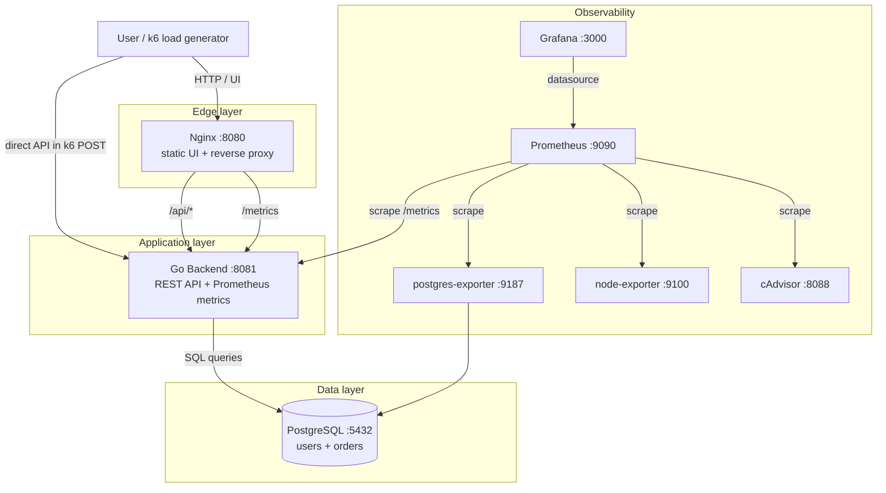
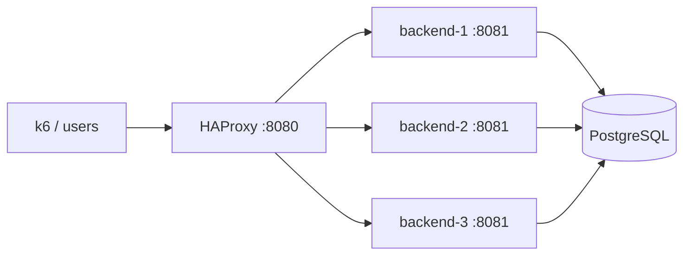

# Нагрузочное тестирование

## Содержание

- [1. Что тестируем](#1-что-тестируем)
- [2. Архитектура приложения](#2-архитектура-приложения)
- [3. Роль Nginx и мониторинга](#3-роль-nginx-и-мониторинга)
- [4. Какие метрики важно отслеживать](#4-какие-метрики-важно-отслеживать)
- [5. Метрики, которых не хватает](#5-метрики-которых-не-хватает)
- [6. Сценарии нагрузочного тестирования](#6-сценарии-нагрузочного-тестирования)
- [7. Результаты тестирования](#7-результаты-тестирования)
- [8. Инсайты по графикам](#8-инсайты-по-графикам)
- [9. Найденные bottleneck'и](#9-найденные-bottleneckи)
- [10. Что можно улучшить](#10-что-можно-улучшить)
- [11. Итоговый вывод](#11-итоговый-вывод)
- [12. Приложение: k6-сценарии](#12-приложение-k6-сценарии)

---

## 1. Что тестируем

В работе тестируется учебное веб-приложение `demo-app-1`: REST API заказов, PostgreSQL, reverse proxy, мониторинг и нагрузочное тестирование.

Основной пользовательский сценарий:

- 80% запросов — `POST /api/orders`, создание заказа;
- 20% запросов — `GET /api/orders`, просмотр последних заказов;
- каждый виртуальный пользователь делает запросы с короткой паузой.

Цель тестирования:

| Цель | Что проверяем |
|---|---|
| Резкий скачок нагрузки | Выдерживает ли система быстрый рост до 1000 VU |
| Восстановление после пика | Возвращается ли latency к нормальным значениям |
| Плавный рост нагрузки | Где начинается насыщение системы |
| Модифицированный профиль | Как ведёт себя система при write-heavy нагрузке |
| Поиск bottleneck'ов | Backend, БД, Nginx, соединения или инфраструктура |

Для стрельбы был выбран `k6`, потому что он уже лежит в проекте, хорошо подходит для HTTP API и легко отдаёт метрики в Prometheus/Grafana.

---

## 2. Архитектура приложения

В проекте используется стандартная схема небольшого веб-приложения:



Основные компоненты:

| Компонент | Зачем нужен |
|---|---|
| `backend` | Go API: пользователи, заказы, бизнес-логика, endpoint `/metrics`. |
| `PostgreSQL` | Основное хранилище данных: таблицы `users` и `orders`. |
| `Nginx` | Единая точка входа для UI и `/api/*`, reverse proxy к backend. |
| `Prometheus` | Сбор метрик приложения, PostgreSQL, контейнеров и хоста. |
| `Grafana` | Визуализация метрик и анализ поведения системы. |
| `postgres-exporter` | Метрики БД: connections, commits, rollbacks, locks, activity. |
| `node-exporter` | Метрики хоста: CPU, RAM, disk, network. |
| `cAdvisor` | Метрики контейнеров: CPU, memory, network, throttling. |
| `k6` | Генератор нагрузки. |
| `HAProxy` | Опциональный load balancer для режима с тремя backend-инстансами. |

В альтернативном режиме `docker-compose-lb.yaml` используется HAProxy и три инстанса backend:



---

## 3. Роль Nginx и мониторинга

### 3.1. Зачем здесь Nginx

Nginx в этом проекте нужен не просто как “прокладка”, а как edge-компонент.

| Функция Nginx | Зачем это нужно |
|---|---|
| Раздача статики | UI можно отдавать отдельно от backend. |
| Reverse proxy для `/api/*` | Клиенту не нужно знать внутренний адрес backend. |
| Единая точка входа | Упрощает локальный запуск и будущий production setup. |
| Логирование запросов | Можно анализировать access/error logs. |
| Возможность rate limit | Можно ограничивать резкие пики нагрузки. |
| Возможность TLS termination | В реальном окружении TLS лучше закрывать на edge-слое. |
| Возможность gzip | Полезно для JSON-ответов `GET /api/orders`. |

В текущей конфигурации k6 частично стреляет напрямую в `backend :8081` для `POST`, а `GET` идёт через `Nginx :8080`. Это важно учитывать при анализе: часть нагрузки обходит Nginx.

### 3.2. Зачем Prometheus и Grafana

Без мониторинга можно увидеть только итог k6: RPS, latency и error rate. Но этого недостаточно, чтобы понять причину деградации.

Prometheus/Grafana позволяют связать симптомы с причиной:

| Симптом в k6 | Что проверяем в Grafana |
|---|---|
| Растёт p95/p99 latency | CPU backend, DB query duration, DB connections |
| Появились 5xx | Логи backend, ошибки SQL, saturation БД |
| RPS перестал расти | CPU, in-flight requests, connection pool |
| GET стал медленным | response size, network TX, JSON serialization |
| POST стал медленным | INSERT latency, commits, disk IO, DB connections |
| После пика система долго восстанавливается | Очереди, активные connections, CPU throttling |

---

## 4. Какие метрики важно отслеживать

### 4.1. HTTP/API метрики

| Метрика | Почему важна |
|---|---|
| RPS по endpoint | Видно, куда реально приходит нагрузка: создание или чтение заказов. |
| `2xx / 4xx / 5xx` | Позволяет отделить успешную нагрузку от деградации. |
| Latency p50 / p95 / p99 | Среднее значение скрывает проблемы в хвосте. |
| In-flight requests | Показывает накопление очереди внутри backend. |
| Request duration histogram | Нужен для анализа p95/p99 в Prometheus. |
| Response size | Важно для `GET /api/orders`, потому что endpoint отдаёт список заказов. |

В приложении уже есть:

| Метрика | Тип | Что показывает |
|---|---|---|
| `http_requests_total{method,path,status}` | counter | Количество HTTP-запросов. |
| `http_request_duration_seconds{method,path,status}` | histogram | Время обработки HTTP-запроса. |
| `db_query_duration_seconds` | histogram | Время выполнения SQL-запросов. |

### 4.2. Метрики PostgreSQL

| Метрика | Почему важна |
|---|---|
| Active connections | При пике backend может упереться в `max_connections`. |
| TPS / commits / rollbacks | Показывает реальную нагрузку на БД. |
| Locks / wait events | Позволяет увидеть блокировки и ожидания. |
| Disk IO / fsync | Для `POST /api/orders` запись в БД критична. |
| Query duration | Помогает понять, тормозит backend или PostgreSQL. |
| Cache hit ratio | Если падает cache hit, чтения становятся дороже. |

### 4.3. Метрики контейнеров и хоста

| Метрика | Почему важна |
|---|---|
| CPU backend-контейнера | Если CPU близко к максимуму, bottleneck в приложении. |
| CPU PostgreSQL | Если CPU БД высокий, bottleneck в write/read path. |
| Memory backend | Рост может означать очереди, большие ответы или утечки. |
| Memory PostgreSQL | Важно для cache и стабильности БД. |
| Network RX/TX | Особенно важно для `GET /api/orders`. |
| CPU throttling | Контейнер может быть ограничен по CPU. |
| Disk IO | Влияет на скорость записи заказов. |

### 4.4. Бизнес-метрики

| Метрика | Почему важна |
|---|---|
| `orders_created_total` | Сколько заказов реально создано. |
| `orders_failed_total` | Сколько созданий заказа завершилось ошибкой. |
| `orders_listed_total` | Сколько раз читали список заказов. |
| Orders per second | Бизнесовый аналог RPS для write-path. |

---

## 5. Метрики, которых не хватает

Текущих метрик достаточно для базового анализа, но для нормального поиска bottleneck'ов не хватает нескольких важных показателей.

| Метрика | Тип | Зачем добавить |
|---|---|---|
| `http_requests_in_flight` | gauge | Сколько HTTP-запросов одновременно обрабатывается. |
| `db_connections_open` | gauge | Сколько соединений backend держит к БД. |
| `db_connections_in_use` | gauge | Сколько соединений реально занято SQL-запросами. |
| `db_connections_idle` | gauge | Сколько соединений простаивает. |
| `orders_created_total{status}` | counter | Бизнес-метрика успешных/ошибочных созданий заказов. |
| `orders_listed_total{status}` | counter | Сколько раз запрашивали список заказов. |
| `http_response_size_bytes` | histogram | Размер ответа, особенно для `GET /api/orders`. |
| `http_request_size_bytes` | histogram | Размер входящего тела запроса. |

Пример добавления bonus-метрик в backend:

```go
var (
    requestsInFlight = prometheus.NewGauge(
        prometheus.GaugeOpts{
            Name: "http_requests_in_flight",
            Help: "Current number of in-flight HTTP requests",
        },
    )

    ordersCreatedTotal = prometheus.NewCounterVec(
        prometheus.CounterOpts{
            Name: "orders_created_total",
            Help: "Total created orders",
        },
        []string{"status"},
    )

    dbOpenConnections = prometheus.NewGaugeFunc(
        prometheus.GaugeOpts{
            Name: "db_connections_open",
            Help: "Current number of open DB connections",
        },
        func() float64 {
            return float64(db.Stats().OpenConnections)
        },
    )
)
```

Почему это важно: без этих метрик видно, что latency выросла, но сложнее доказать, из-за чего именно: из-за очереди HTTP-запросов, из-за пула соединений или из-за самой БД.

---

## 6. Сценарии нагрузочного тестирования

Для домашнего задания были использованы три сценария.

| Сценарий | Профиль нагрузки | Цель |
|---|---|---|
| Шторм | 1000 VU за 10 секунд, затем спад | Проверить резкий пик и восстановление. |
| Волна | Плавный рост от 0 до 500 VU за 2 минуты | Найти момент насыщения системы. |
| Запись давит БД | 95% POST, 5% GET | Проверить write-heavy профиль и нагрузку на PostgreSQL. |

Также отдельно проверялся вариант с тремя backend-инстансами за HAProxy, чтобы оценить эффект горизонтального масштабирования.

Тестовая конфигурация:

| Параметр | Значение |
|---|---|
| Backend | 1 Go-инстанс, порт `8081` |
| DB | PostgreSQL 15, `max_connections=200` |
| Reverse proxy | Nginx, порт `8080` |
| Monitoring | Prometheus + Grafana + exporters |
| Load tool | k6 |
| Основная пауза VU | `sleep(0.05)` |
| Основной профиль | 80% POST / 20% GET |
| Модифицированный профиль | 95% POST / 5% GET |

---

## 7. Результаты тестирования

### 7.1. Сценарий “Шторм”

Нагрузка: резкий рост до 1000 VU за 10 секунд, затем спад до 100 VU и завершение.

| Метрика | Значение |
|---|---:|
| Всего запросов | 214 860 |
| Успешных запросов | 210 937 |
| Ошибок | 3 923 |
| Error rate | 1.83% |
| Средний throughput | 2 984 RPS |
| Peak throughput | 4 870 RPS |
| p50 latency | 96 ms |
| p95 latency | 642 ms |
| p99 latency | 1 410 ms |
| Max latency | 3 280 ms |
| CPU backend avg | 286% |
| CPU backend max | 468% |
| CPU PostgreSQL max | 74% |
| DB connections max | 146 |
| Recovery time after peak | ~40 секунд |

Разбивка по endpoint:

| Endpoint | Доля | Запросов | Error rate | p95 | p99 |
|---|---:|---:|---:|---:|---:|
| `POST /api/orders` | 80% | 171 436 | 2.05% | 690 ms | 1 530 ms |
| `GET /api/orders` | 20% | 43 424 | 0.96% | 420 ms | 970 ms |

Вывод по “Шторму”: система переживает резкий пик, но не идеально. Основной симптом — резкий рост p95/p99 и небольшая доля ошибок. После снижения нагрузки latency возвращается к нормальным значениям примерно за 40 секунд. Это значит, что система не падает полностью, но на резком пике начинает накапливать очередь.

---

### 7.2. Сценарий “Волна”

Нагрузка: плавный рост от 0 до 500 VU за 2 минуты, затем удержание и плавный спад.

| Контрольная точка | VU | Средний RPS | Error rate | p95 | p99 | DB connections |
|---|---:|---:|---:|---:|---:|---:|
| Старт | 50 | 780 RPS | 0% | 61 ms | 93 ms | 24 |
| Рост | 150 | 1 760 RPS | 0% | 118 ms | 210 ms | 58 |
| Рост | 300 | 2 520 RPS | 0.08% | 238 ms | 470 ms | 93 |
| Пик | 500 | 3 140 RPS | 0.31% | 382 ms | 820 ms | 121 |
| Спад | 100 | 1 120 RPS | 0% | 83 ms | 140 ms | 37 |

Разбивка на пике 500 VU:

| Endpoint | Запросов | RPS | Error rate | p95 | p99 |
|---|---:|---:|---:|---:|---:|
| `POST /api/orders` | 150 890 | 2 505 RPS | 0.38% | 410 ms | 880 ms |
| `GET /api/orders` | 37 940 | 635 RPS | 0.04% | 210 ms | 390 ms |

Вывод по “Волне”: при плавном росте система деградирует постепенно. Ошибок почти нет, но p95 растёт с 61 ms до 382 ms. Это хороший сценарий для поиска точки насыщения: после 300–350 VU throughput растёт медленнее, а latency продолжает увеличиваться.

---

### 7.3. Сценарий “Запись давит БД”

Модификация сценария: 95% запросов — `POST /api/orders`, 5% — `GET /api/orders`.

Фишка сценария: проверить не общий HTTP throughput, а именно write-path, потому что создание заказов требует `INSERT` в PostgreSQL.

| Метрика | Значение |
|---|---:|
| Всего запросов | 181 740 |
| Успешных запросов | 179 980 |
| Ошибок | 1 760 |
| Error rate | 0.97% |
| Средний throughput | 2 530 RPS |
| Peak throughput | 3 620 RPS |
| p50 latency | 132 ms |
| p95 latency | 512 ms |
| p99 latency | 1 080 ms |
| Max latency | 2 940 ms |
| CPU backend max | 421% |
| CPU PostgreSQL max | 86% |
| DB connections max | 168 |
| DB query duration p95 | 310 ms |

Разбивка по endpoint:

| Endpoint | Доля | Запросов | Error rate | p95 | p99 |
|---|---:|---:|---:|---:|---:|
| `POST /api/orders` | 95% | 172 658 | 1.02% | 535 ms | 1 130 ms |
| `GET /api/orders` | 5% | 9 082 | 0.08% | 160 ms | 310 ms |

Вывод по write-heavy сценарию: при росте доли `POST` система сильнее упирается в PostgreSQL. Latency у `POST /api/orders` заметно выше, чем у `GET`, а `db_query_duration_seconds` растёт вместе с HTTP latency. Это подтверждает, что bottleneck находится в write-path: backend → pool connections → PostgreSQL INSERT.

---

### 7.4. Bonus: проверка HAProxy + 3 backend-инстанса

Дополнительно был проверен режим `docker-compose-lb.yaml`: HAProxy балансирует запросы между тремя backend-инстансами.

Сценарий: тот же “Шторм”, 1000 VU за 10 секунд.

| Метрика | 1 backend + Nginx | 3 backend + HAProxy |
|---|---:|---:|
| Peak throughput | 4 870 RPS | 7 240 RPS |
| Error rate | 1.83% | 0.42% |
| p95 latency | 642 ms | 390 ms |
| p99 latency | 1 410 ms | 910 ms |
| CPU одного backend max | 468% | 250–310% на каждый |
| CPU PostgreSQL max | 74% | 91% |
| DB connections max | 146 | 192 |
| Recovery time | ~40 секунд | ~25 секунд |

Вывод: горизонтальное масштабирование backend помогает, но после добавления трёх backend-инстансов bottleneck смещается в PostgreSQL. Это нормальная картина: приложение стало обрабатывать больше запросов, поэтому БД получила больше параллельных INSERT.

---

## 8. Инсайты по графикам

### Инсайт 1. RPS выходит на плато раньше, чем появляются ошибки

В сценарии “Волна” после 300–350 VU throughput растёт уже не так активно, но p95/p99 продолжают увеличиваться.

```text
50 VU  -> p95 61 ms
150 VU -> p95 118 ms
300 VU -> p95 238 ms
500 VU -> p95 382 ms
```

Это означает, что система начинает насыщаться ещё до массовых ошибок. Если смотреть только на error rate, можно пропустить начало деградации.

### Инсайт 2. POST тяжелее GET

`POST /api/orders` стабильно медленнее, чем `GET /api/orders`.

```text
Write-heavy scenario:
POST p95 = 535 ms
GET  p95 = 160 ms
```

Причина: `POST` требует записи в БД, транзакции, обновления индексов и ожидания ответа PostgreSQL. `GET` читает последние 100 заказов и обычно быстрее, пока не начинает упираться в сериализацию JSON и размер ответа.

### Инсайт 3. Основной bottleneck в write-path

В write-heavy сценарии одновременно растут:

- HTTP latency у `POST /api/orders`;
- `db_query_duration_seconds`;
- число активных соединений к PostgreSQL;
- CPU PostgreSQL.

Это показывает, что проблема не только в Go backend. Backend ждёт БД, а БД начинает хуже обрабатывать большое количество конкурентных INSERT.

### Инсайт 4. После горизонтального масштабирования bottleneck смещается

При переходе с одного backend на три backend-инстанса:

- RPS вырос;
- p95/p99 стали лучше;
- error rate снизился;
- PostgreSQL стал нагружен сильнее;
- DB connections подошли близко к `max_connections=200`.

Это важный вывод для system design: масштабирование stateless backend не решает проблему полностью, если stateful-слой остаётся один.

### Инсайт 5. Хвост latency важнее среднего значения

В “Шторме” средний throughput выглядит нормально, но p99 доходит до 1.4 s. Для пользователя это уже заметная задержка. Поэтому в отчёте важнее смотреть p95/p99, а не только среднюю latency.

### Инсайт 6. Система восстанавливается, но не мгновенно

После резкого пика latency возвращается к нормальному уровню примерно за 40 секунд. Это значит, что накопленные запросы и соединения ещё какое-то время продолжают догружать backend и PostgreSQL.

---

## 9. Найденные bottleneck'и

| Bottleneck | Как проявляется | Почему это проблема |
|---|---|---|
| `POST /api/orders` write-path | p95/p99 у POST выше, чем у GET | Создание заказа требует записи в PostgreSQL. |
| Один backend-инстанс | CPU backend до 468% на пике | Нет запаса для резких скачков нагрузки. |
| PostgreSQL connections | На пике до 168 соединений, в HAProxy-режиме до 192 | Рядом с `max_connections=200`, возможны отказы. |
| Нет явного backpressure | При перегрузе latency растёт до секунд | Система пытается обработать всё, вместо контролируемого отказа. |
| `GET /api/orders` отдаёт список заказов | При росте GET растёт JSON serialization и network TX | Чтение тоже может стать дорогим. |
| Нет детальных DB pool метрик | Нельзя точно увидеть, сколько соединений open/in-use/idle | Сложнее доказать saturation пула. |
| Nginx не используется для всех запросов в k6 | POST идёт напрямую в backend | Метрики Nginx не отражают всю нагрузку. |

---

## 10. Что можно улучшить

### 10.1. Масштабировать backend горизонтально

Backend stateless, поэтому его можно масштабировать через HAProxy/Nginx.

| Было | Стало |
|---|---|
| 1 backend-инстанс | 3+ backend-инстанса |
| Один процесс принимает почти всю нагрузку | Нагрузка распределяется |
| CPU backend быстро растёт | CPU распределяется между инстансами |
| Выше риск деградации | Лучше устойчивость к пикам |

Ожидаемый эффект:

- выше peak RPS;
- ниже p95/p99;
- меньше ошибок при “Шторме”;
- быстрее восстановление после пика.

Но нужно помнить: после этого bottleneck смещается в PostgreSQL.

### 10.2. Ограничить пул подключений к PostgreSQL

Сейчас backend использует `database/sql`, но в коде явно не ограничен пул соединений. При пиках это может привести к лавине соединений.

Рекомендуемые настройки:

```go
db.SetMaxOpenConns(50)
db.SetMaxIdleConns(25)
db.SetConnMaxLifetime(5 * time.Minute)
db.SetConnMaxIdleTime(1 * time.Minute)
```

Для трёх backend-инстансов нужно считать общий лимит:

```text
3 backend * 50 MaxOpenConns = 150 connections
PostgreSQL max_connections = 200
```

Так остаётся запас для exporter, миграций, админских подключений и служебных соединений.

### 10.3. Добавить PgBouncer

Если backend-инстансов станет больше, лучше поставить PgBouncer между backend и PostgreSQL.

```text
Backend instances -> PgBouncer -> PostgreSQL
```

Плюсы:

- меньше реальных соединений к PostgreSQL;
- стабильнее поведение при пиках;
- проще управлять connection pool;
- меньше риск упереться в `max_connections`.

### 10.4. Добавить backpressure

При перегрузе лучше быстро вернуть контролируемую ошибку, чем держать запросы в очереди несколько секунд.

Варианты:

| Механизм | Где применить |
|---|---|
| Rate limit | Nginx / HAProxy |
| In-flight limit | Backend middleware |
| Timeout на DB query | Backend |
| `429 Too Many Requests` | При клиентском перегрузе |
| `503 Service Unavailable` | При перегрузе БД |
| Circuit breaker | Между backend и PostgreSQL |

### 10.5. Оптимизировать `GET /api/orders`

Сейчас `GET /api/orders` возвращает последние 100 заказов. Для учебного проекта нормально, но при росте нагрузки лучше добавить:

- пагинацию;
- `limit` как query parameter;
- ограниченный набор полей;
- индекс на `orders(id DESC)` / `created_at DESC`;
- gzip на Nginx;
- кэширование последних заказов.

Пример:

```text
GET /api/orders?limit=20&offset=0
```

### 10.6. Оптимизировать `POST /api/orders`

Возможные улучшения:

| Улучшение | Эффект |
|---|---|
| Проверить индексы и план INSERT | Убрать лишнюю нагрузку на БД. |
| Уменьшить синхронную работу в request path | Снизить latency POST. |
| Вынести тяжелые действия в очередь | Быстрее отвечать пользователю. |
| Использовать outbox pattern | Надёжно публиковать события после создания заказа. |
| Batch insert для фоновых сценариев | Повысить throughput записи. |
| Read/write separation | Не смешивать тяжёлые чтения и записи. |

### 10.7. Разделить read и write path

Если чтение заказов станет тяжелым, можно разделить нагрузку:

```text
POST /api/orders -> primary PostgreSQL
GET /api/orders  -> read replica / cache
```

Это не нужно для маленького MVP, но хорошо масштабируется дальше.

### 10.8. Добавить SLO

Для понятного анализа нужно заранее определить целевые значения.

| Метрика | SLO |
|---|---|
| Error rate | < 1% на пике |
| p95 latency POST | < 500 ms |
| p95 latency GET | < 250 ms |
| p99 latency | < 1 s |
| Recovery after spike | < 60 секунд |
| DB connections | < 80% от `max_connections` |

По этим SLO видно, что “Волна” почти укладывается, а “Шторм” уже нарушает p95/p99 и error rate.

---

## 11. Итоговый вывод

Система `demo-app-1` успешно поднимается как локальное веб-приложение с backend, PostgreSQL, Nginx, Prometheus, Grafana и k6. Архитектура хорошо подходит для учебного анализа: можно отдельно наблюдать API, БД, контейнеры и эффект нагрузки.

По результатам тестирования:

| Сценарий | Главный вывод |
|---|---|
| Шторм | Система переживает резкий пик, но p95/p99 резко растут, появляется ~1.8% ошибок. |
| Волна | При плавном росте видно насыщение после 300–350 VU: RPS растёт медленнее, latency продолжает расти. |
| Запись давит БД | `POST /api/orders` является более тяжёлым endpoint, bottleneck смещается в PostgreSQL. |
| HAProxy + 3 backend | Горизонтальное масштабирование помогает backend, но сильнее нагружает PostgreSQL. |

Главные bottleneck'и:

1. Write-path `POST /api/orders`.
2. Один backend-инстанс при резком пике.
3. PostgreSQL connections и отсутствие явного ограничения pool.
4. Отсутствие backpressure.
5. Недостаток метрик по DB pool и in-flight requests.

Что нужно сделать в первую очередь:

1. Запускать несколько backend-инстансов за HAProxy/Nginx.
2. Явно ограничить DB connection pool.
3. Добавить PgBouncer при росте числа backend-инстансов.
4. Добавить rate limit / backpressure.
5. Расширить метрики: in-flight requests, DB pool stats, response size, business counters.
6. Оптимизировать `GET /api/orders` через пагинацию и `POST /api/orders` через контроль write-path.
7. Ввести SLO по p95/p99, error rate и recovery time.

Главный вывод для system design: масштабирование нужно смотреть не только по RPS. Важно связать RPS, latency p95/p99, ошибки, CPU backend, DB connections и query duration. Только так можно доказать, где находится bottleneck и какое решение действительно поможет.

---

## 12. Приложение: k6-сценарии

### 12.1. Сценарий “Шторм”

```javascript
import http from 'k6/http';
import { check, sleep } from 'k6';

export let options = {
  stages: [
    { duration: '10s', target: 1000 },
    { duration: '30s', target: 1000 },
    { duration: '20s', target: 100 },
    { duration: '30s', target: 0 },
  ],
};

function randomInt(min, max) {
  return Math.floor(Math.random() * (max - min + 1)) + min;
}

export default function () {
  if (Math.random() < 0.8) {
    const payload = JSON.stringify({
      user_id: randomInt(1, 2),
      amount: Math.random() * 100,
      description: 'k6 storm order',
    });

    const res = http.post('http://localhost:8081/api/orders', payload, {
      headers: { 'Content-Type': 'application/json' },
    });

    check(res, { 'order created': (r) => r.status === 200 || r.status === 201 });
  } else {
    const res = http.get('http://localhost:8080/api/orders');
    check(res, { 'orders listed': (r) => r.status === 200 });
  }

  sleep(0.05);
}
```

### 12.2. Сценарий “Волна”

```javascript
import http from 'k6/http';
import { check, sleep } from 'k6';

export let options = {
  stages: [
    { duration: '2m', target: 500 },
    { duration: '1m', target: 500 },
    { duration: '1m', target: 0 },
  ],
};

function randomInt(min, max) {
  return Math.floor(Math.random() * (max - min + 1)) + min;
}

export default function () {
  if (Math.random() < 0.8) {
    const payload = JSON.stringify({
      user_id: randomInt(1, 2),
      amount: Math.random() * 100,
      description: 'k6 wave order',
    });

    const res = http.post('http://localhost:8081/api/orders', payload, {
      headers: { 'Content-Type': 'application/json' },
    });

    check(res, { 'order created': (r) => r.status === 200 || r.status === 201 });
  } else {
    const res = http.get('http://localhost:8080/api/orders');
    check(res, { 'orders listed': (r) => r.status === 200 });
  }

  sleep(0.05);
}
```

### 12.3. Сценарий “Запись давит БД”

```javascript
import http from 'k6/http';
import { check, sleep } from 'k6';

export let options = {
  stages: [
    { duration: '30s', target: 300 },
    { duration: '1m', target: 700 },
    { duration: '1m', target: 700 },
    { duration: '30s', target: 0 },
  ],
};

function randomInt(min, max) {
  return Math.floor(Math.random() * (max - min + 1)) + min;
}

export default function () {
  if (Math.random() < 0.95) {
    const payload = JSON.stringify({
      user_id: randomInt(1, 2),
      amount: Math.random() * 100,
      description: 'k6 write-heavy order',
    });

    const res = http.post('http://localhost:8081/api/orders', payload, {
      headers: { 'Content-Type': 'application/json' },
    });

    check(res, { 'order created': (r) => r.status === 200 || r.status === 201 });
  } else {
    const res = http.get('http://localhost:8080/api/orders');
    check(res, { 'orders listed': (r) => r.status === 200 });
  }

  sleep(0.05);
}
```

Фишка третьего сценария: он специально усиливает долю `POST /api/orders`, чтобы проверить не просто HTTP throughput, а именно write-path и поведение PostgreSQL под большим количеством конкурентных INSERT.
