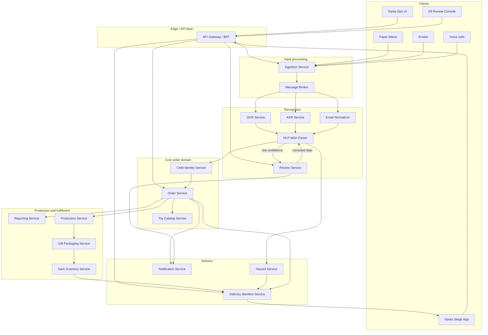
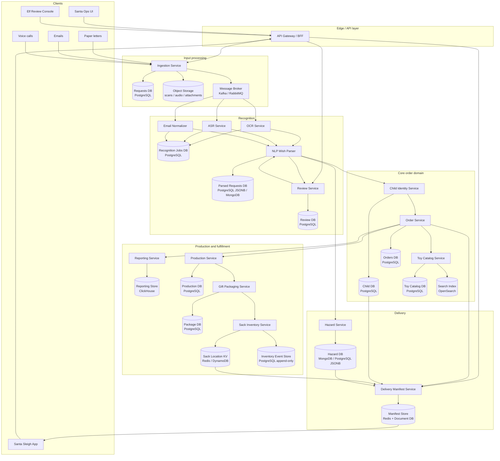

# Santa's Workshop Order Processing System — HLD, Databases and Infrastructure

## Содержание

- [1. Контекст задания](#1-контекст-задания)
- [2. Исходные ФТ и НФТ из HW_1](#2-исходные-фТ-и-нФТ-из-hw_1)
- [3. Part 1. Декомпозиция на модули и сервисы](#3-part-1-декомпозиция-на-модули-и-сервисы)
- [4. Part 1. Способ взаимодействия между сервисами](#4-part-1-способ-взаимодействия-между-сервисами)
- [5. Part 1. Верхнеуровневая HLD-схема](#5-part-1-верхнеуровневая-hld-схема)
- [6. Part 2. Выбор баз данных](#6-part-2-выбор-баз-данных)
- [7. Part 2. Репликация и шардинг](#7-part-2-репликация-и-шардинг)
- [8. Part 2. HLD-схема с базами данных](#8-part-2-hld-схема-с-базами-данных)
- [9. Part 3. Дополнительные компоненты HLD](#9-part-3-дополнительные-компоненты-hld)
- [10. Part 3. Финальная HLD-схема](#10-part-3-финальная-hld-схема)
- [11. Итоговое решение](#11-итоговое-решение)

---

## 1. Контекст задания

Система проектируется для Santa's Workshop. Каждый год Santa получает миллионы запросов на подарки через несколько каналов:

- бумажные письма;
- email;
- голосовые звонки.

Нужно распознать исходный запрос, извлечь данные ребёнка и wish list, превратить пожелания в производственные заказы для эльфов, сформировать consolidated reports, разложить готовые подарки в magic sack и подготовить delivery manifest для Santa.

Главная особенность системы — большой сезонный пик перед Christmas Eve. Поэтому решение нельзя строить как один большой сервис, который последовательно делает всё. Нужно разделить систему на независимые доменные и технические компоненты, чтобы отдельно масштабировать тяжёлые части: OCR, ASR, NLP, order processing, reporting и delivery read model.

---

## 2. Исходные ФТ и НФТ из HW_1

### 2.1 Functional Requirements

| ID | Requirement | Priority | Комментарий |
|---|---|---|---|
| FR-1 | Система должна принимать бумажные письма, email и voice calls | P0 | Базовый входной поток |
| FR-2 | Система должна распознавать текст из письма через OCR | P0 | Критично из-за плохого почерка |
| FR-3 | Система должна переводить voice call в текст через ASR | P0 | Нужна поддержка голосового канала |
| FR-4 | Система должна извлекать child details: имя, адрес, возраст, wish list | P0 | Без этого нельзя собрать заказ |
| FR-5 | Система должна нормализовать пожелания в toy SKU | P0 | Эльфам нужны производственные единицы |
| FR-6 | Система должна дедуплицировать запросы от одного ребёнка | P0 | Ребёнок может отправить письмо и email |
| FR-7 | Система должна создавать toy order по каждому ребёнку | P0 | Основная бизнес-сущность |
| FR-8 | Система должна формировать consolidated reports по игрушкам | P0 | Эльфы должны знать количество каждого типа |
| FR-9 | Система должна сохранять sack location для каждого подарка | P0 | Santa должен быстро найти подарок |
| FR-10 | Система должна формировать delivery manifest для каждого дома | P0 | Нужен список подарков на доставку |
| FR-11 | Система должна показывать delivery hazards | P1 | Повышает безопасность и точность доставки |
| FR-12 | Система должна отправлять low-confidence cases на ручную проверку | P1 | Защита от ошибок OCR / ASR |
| FR-13 | Система должна поддерживать audit trail по каждому заказу | P1 | Можно понять, откуда взялся заказ |
| FR-14 | Система должна поддерживать late changes до cutoff time | P2 | Дети могут менять пожелания |
| FR-15 | Система должна показывать статус заказа | P2 | Полезно для Santa Ops team |

### 2.2 Non-Functional Requirements

| Категория | Requirement | Метрика |
|---|---|---|
| Availability | Ingestion и order processing должны работать в пиковый сезон | 99.95% за последние 30 дней до Christmas Eve |
| Latency | Email должен попадать в processing queue быстро | p95 < 5 секунд |
| Latency | OCR / ASR результат должен появляться за разумное время | p95 < 2 минуты |
| Accuracy | Auto-created order должен быть достаточно точным | ≥ 99.5% после review pipeline |
| Accuracy | Для low-confidence input нужен manual review | confidence < 0.90 |
| Scalability | Система должна выдерживать сезонный пик | до 10x от среднего daily traffic |
| Consistency | Подарок не должен быть доставлен дважды | exactly-once delivery marking |
| Durability | Raw input и orders не должны теряться | replication + backup |
| Observability | Для каждого заказа должен быть trace | request_id / child_id / order_id |
| Security | Данные детей должны быть защищены | encryption at rest + access control |
| Performance | Поиск подарка в sack должен быть мгновенным | p99 < 50 ms |
| Reporting | Отчёт для эльфов должен обновляться регулярно | hourly в пиковый сезон |

---

## 3. Part 1. Декомпозиция на модули и сервисы

### 3.1 Подход к декомпозиции

Используем DDD-подход и разделяем систему по bounded contexts. В этой задаче удобно не смешивать обработку входящих запросов, распознавание текста, создание заказов, производство, inventory и доставку. У этих частей разные модели данных, разные требования к консистентности и разные профили нагрузки.

Например, OCR и ASR — compute-heavy сервисы. Их нужно масштабировать по воркерам и очередям. Order Service, наоборот, должен аккуратно работать с транзакциями и не создавать дубли. Delivery Manifest Service должен быть оптимизирован на быстрые чтения, потому что Santa во время доставки не должен ждать тяжёлых запросов к нескольким базам.

### 3.2 Домены и основные сущности

| Domain | Смысл домена | Основные сущности |
|---|---|---|
| Input Processing | Приём входящих писем, email и звонков | `RawRequest`, `ParsedRequest`, `InputChannel` |
| Recognition | OCR / ASR / нормализация email | `RecognitionJob`, `RecognitionResult`, `ConfidenceScore` |
| Wish Understanding | Извлечение имени, адреса, wish list и hazards | `Wish`, `ParsedChildDetails`, `HazardCandidate` |
| Child Identity | Дедупликация ребёнка по имени, адресу и другим признакам | `ChildProfile`, `Address`, `IdentityMatch` |
| Toy Ordering | Создание заказов на игрушки | `ToySKU`, `ToyOrder`, `OrderStatus` |
| Elf Production | Агрегация спроса и производственные партии | `ProductionBatch`, `ToyDemandReport` |
| Sack Inventory | Учёт конкретных подарков и их location в sack | `GiftPackage`, `SackLocation`, `InventoryEvent` |
| Sleigh Delivery | Manifest для Santa и статусы доставки | `DeliveryStop`, `DeliveryManifest`, `DeliveryEvent` |
| Review | Ручная проверка спорных случаев | `ReviewTask`, `ReviewDecision` |

### 3.3 Получившиеся сервисы

| Service                   | Ответственность                                                  | Почему отдельно                                                 |
| ------------------------- | ---------------------------------------------------------------- | --------------------------------------------------------------- |
| API Gateway / BFF         | Единая точка входа для UI Santa Ops, Review Console и Sleigh App | Не хочется открывать внутренние сервисы наружу                  |
| Ingestion Service         | Принимает письма, email и voice calls, создаёт `RawRequest`      | Каналы разные, но дальше нужен единый pipeline                  |
| OCR Service               | Распознаёт бумажные письма                                       | Сервис сильно зависит от ML/compute и масштабируется отдельно   |
| ASR Service               | Переводит звонки в текст                                         | Voice processing отличается от OCR по нагрузке и данным         |
| Email Normalizer          | Очищает email от подписей, вложений и мусора                     | Email проще, но требует своей нормализации                      |
| NLP Wish Parser           | Извлекает child details, wishes и hazards                        | Центр смысловой обработки запроса                               |
| Review Service            | Отправляет low-confidence cases эльфам-операторам                | Нужен human-in-the-loop для качества                            |
| Child Identity Service    | Склеивает дубликаты по ребёнку и адресу                          | Один ребёнок может написать несколько раз                       |
| Toy Catalog Service       | Маппит wish на конкретный `ToySKU`                               | Производство работает через каталог, а не через свободный текст |
| Order Service             | Создаёт и обновляет toy orders                                   | Основная транзакционная бизнес-логика                           |
| Reporting Service         | Делает consolidated reports для эльфов                           | Агрегаты лучше считать отдельно от write-path заказов           |
| Production Service        | Формирует партии для мастерских                                  | Отделяет demand от фактического производства                    |
| Gift Packaging Service    | Создаёт `GiftPackage` после производства                         | Нужна связь между заказом и физическим подарком                 |
| Sack Inventory Service    | Хранит location каждого gift package                             | Критично для быстрой доставки                                   |
| Hazard Service            | Хранит hazards по адресу                                         | Риски могут обновляться отдельно от заказов                     |
| Delivery Manifest Service | Формирует read model для Santa                                   | Во время доставки нужен быстрый и стабильный доступ             |
| Notification Service      | Отправляет внутренние уведомления Santa Ops и эльфам             | Уведомления не должны тормозить основной процесс                |

### 3.4 Обоснование границ сервисов

| Граница | Почему так |
|---|---|
| Ingestion отделён от OCR / ASR | Приём данных должен быть быстрым и устойчивым. Если OCR тормозит, письма всё равно должны приниматься в очередь |
| OCR и ASR отдельные | Это разные ML-пайплайны, разные модели, разные требования к ресурсам |
| NLP Parser отдельный | Он работает уже с текстом и не должен знать, откуда текст пришёл |
| Child Identity отдельный | Дедупликация — сложная доменная логика, её будут использовать разные сценарии |
| Order Service отдельно от Catalog | Каталог отвечает за смысл wish → SKU, Order Service — за жизненный цикл заказа |
| Reporting отдельно от Order Service | Отчёты — это read/analytics workload, он не должен грузить транзакционную БД заказов |
| Sack Inventory отдельно от Delivery | Inventory отвечает за фактическое место подарка, Delivery — за маршрут и manifest |
| Review Service отдельно | Ручная проверка может иметь свой UI, очередь задач и SLA |

---

## 4. Part 1. Способ взаимодействия между сервисами

### 4.1 Общая стратегия

Основной способ взаимодействия — event-driven architecture через message broker. Это хорошо подходит для системы, где есть длинный pipeline: input → recognition → parsing → identity → order → reporting → production → packaging → sack → delivery.

При этом не все вызовы нужно делать асинхронными. Для быстрых справочных операций, где нужен ответ прямо сейчас, используем синхронные REST/gRPC вызовы. Например, Order Service может синхронно обратиться к Toy Catalog Service, чтобы проверить `sku_id`, а Review Console может синхронно получать задачу для оператора.

Итоговый подход:

- asynchronous events — для длинных, тяжёлых и устойчивых к задержкам процессов;
- synchronous API — для read-запросов, проверки справочников и UI;
- WebSocket / SSE — для live-обновлений в Review Console и Santa Ops Dashboard;
- idempotency keys и outbox pattern — чтобы не создавать дубли заказов при retry.

### 4.2 Интеграции между сервисами

| Интеграция | Тип | Почему так |
|---|---|---|
| Client UI → API Gateway | Синхронная HTTPS | UI ожидает быстрый ответ |
| API Gateway → внутренние сервисы | Синхронная REST/gRPC | Gateway агрегирует данные и скрывает внутреннюю структуру |
| Ingestion Service → Object Storage | Синхронная запись | Raw input нужно сохранить до дальнейшей обработки |
| Ingestion Service → Processing Queue | Асинхронная | OCR / ASR могут быть медленными, поэтому нельзя блокировать приём запросов |
| Processing Queue → OCR / ASR / Email Normalizer | Асинхронная | Воркеры могут масштабироваться независимо |
| OCR / ASR → NLP Wish Parser | Асинхронная через событие `TextRecognized` | Recognition завершился — дальше можно парсить |
| NLP Wish Parser → Review Service | Асинхронная | Low-confidence cases не должны останавливать весь pipeline |
| Review Service → NLP Wish Parser / Order Service | Асинхронная после решения оператора | Исправленные данные возвращаются в процесс |
| NLP Wish Parser → Child Identity Service | Синхронная или асинхронная | Для создания заказа нужен `child_id`, но процесс может идти через очередь |
| Order Service → Toy Catalog Service | Синхронная gRPC | Нужна быстрая проверка SKU и правил каталога |
| Order Service → Orders DB | Синхронная транзакция | Заказ должен быть создан консистентно |
| Order Service → Reporting Service | Асинхронная через `OrderCreated` | Отчёт может обновиться немного позже |
| Order Service → Production Service | Асинхронная | Производство работает партиями и не должно блокировать заказ |
| Production Service → Gift Packaging Service | Асинхронная | Подарок создаётся после завершения производства |
| Gift Packaging Service → Sack Inventory Service | Синхронная + событие | Location нужно записать точно, а событие нужно для manifest |
| Sack Inventory Service → Delivery Manifest Service | Асинхронная через `PackagePlaced` | Manifest обновляется по событиям inventory |
| Hazard Service → Delivery Manifest Service | Асинхронная + read API | Hazards обновляются отдельно и попадают в manifest |
| Delivery Manifest Service → Santa Sleigh App | Синхронная read-only API + локальный cache | Во время доставки нужен быстрый доступ |
| Notification Service ← события от сервисов | Асинхронная | Уведомления не должны влиять на основной бизнес-процесс |

### 4.3 Основные события

| Event | Кто публикует | Кто потребляет | Зачем нужно |
|---|---|---|---|
| `RawRequestReceived` | Ingestion Service | OCR / ASR / Email Normalizer | Запустить обработку входного запроса |
| `TextRecognized` | OCR / ASR / Email Normalizer | NLP Wish Parser | Передать распознанный текст |
| `LowConfidenceDetected` | NLP Wish Parser | Review Service | Отправить спорный случай на ручную проверку |
| `ReviewCompleted` | Review Service | NLP Wish Parser / Order Service | Продолжить обработку после исправления |
| `ChildResolved` | Child Identity Service | Order Service | Передать нормализованный `child_id` |
| `OrderCreated` | Order Service | Reporting, Production, Delivery | Обновить downstream-сервисы |
| `OrderUpdated` | Order Service | Reporting, Production, Delivery | Учесть late changes |
| `ProductionBatchCreated` | Production Service | Elf workshop systems | Передать задания эльфам |
| `GiftPackaged` | Gift Packaging Service | Sack Inventory Service | Положить подарок в sack |
| `PackagePlaced` | Sack Inventory Service | Delivery Manifest Service | Добавить location в manifest |
| `HazardUpdated` | Hazard Service | Delivery Manifest Service | Обновить риски доставки |
| `DeliveryCompleted` | Santa Sleigh App | Delivery Manifest Service / Order Service | Зафиксировать факт доставки |

### 4.4 Почему не только синхронные вызовы

Если сделать весь процесс синхронным, то один запрос будет ждать OCR, NLP, дедупликацию, создание заказа, обновление отчёта, производство и inventory. Это плохо по трём причинам:

1. Любой медленный сервис начнёт тормозить весь pipeline.
2. При падении одного downstream-сервиса начнут падать входящие запросы.
3. Сложно выдержать сезонный пик, потому что compute-heavy части нельзя будет независимо масштабировать.

Поэтому основной поток делаем асинхронным. Синхронные вызовы оставляем только там, где реально нужен быстрый ответ или строгая проверка перед записью.

---

## 5. Part 1. Верхнеуровневая HLD-схема

---

## 6. Part 2. Выбор баз данных

### 6.1 Алгоритм выбора БД

Для каждого сервиса выбираем хранилище не по принципу “одна БД на всё”, а по сценарию использования:

1. Смотрим на модель данных: табличная, документная, key-value, blob, search, analytics.
2. Смотрим на операции: много write, много read, поиск, агрегации, append-only события.
3. Смотрим на требования к консистентности: strong consistency, eventual consistency, exactly-once, audit trail.
4. Смотрим на масштабирование: нужно ли шардировать, есть ли сезонный пик, какие ключи партиционирования.
5. Смотрим на стоимость хранения: raw scans и audio нельзя хранить в обычной relational DB.

### 6.2 Выбор БД по сервисам

| Сервис | Что хранит | Тип БД | Возможная реализация | Почему подходит |
|---|---|---|---|---|
| Ingestion Service | metadata по `RawRequest`, status, channel, received_at | Relational DB | PostgreSQL | Нужны статусы, транзакции и понятный audit trail |
| Ingestion Service | raw scans, audio, email attachments | Object Storage | S3 / MinIO / Yandex Object Storage | Большие файлы дешевле хранить как blob |
| Recognition Services | jobs, attempts, confidence, model version | Relational DB + queue state | PostgreSQL + Kafka/RabbitMQ | Нужна трассировка попыток и статусов обработки |
| NLP Wish Parser | parsed text, extracted fields, confidence | Document DB / PostgreSQL JSONB | MongoDB или PostgreSQL JSONB | Результат парсинга может иметь разную структуру |
| Review Service | review tasks, decisions, operator comments | Relational DB | PostgreSQL | Важны статусы, история решений и SLA |
| Child Identity Service | child profiles, addresses, identity links | Relational DB | PostgreSQL | Нужны связи, уникальность и консистентность |
| Toy Catalog Service | SKU, категории, правила маппинга | Relational DB + Search Index | PostgreSQL + Elasticsearch/OpenSearch | Каталог структурирован, но нужен поиск по тексту wish |
| Order Service | toy orders, statuses, order history | Relational DB | PostgreSQL | Заказы требуют транзакций и constraints |
| Reporting Service | агрегаты по SKU, регионам, статусам | OLAP / Column Store | ClickHouse | Быстрые агрегации по большим объёмам |
| Production Service | batches, production status | Relational DB | PostgreSQL | Производственные партии хорошо ложатся в таблицы |
| Gift Packaging Service | package_id, order_id, label | Relational DB | PostgreSQL | Нужна связь заказа и конкретного подарка |
| Sack Inventory Service | package → location, inventory events | Key-value + Event Store | Redis/DynamoDB + PostgreSQL append-only | Нужен p99 < 50 ms для поиска location и история перемещений |
| Hazard Service | hazards by address | Document DB / Relational DB | MongoDB или PostgreSQL JSONB | У адреса может быть несколько разных hazards с произвольными деталями |
| Delivery Manifest Service | precomputed delivery manifests | Key-value / Document DB | Redis + MongoDB | Manifest должен быстро читаться приложением Santa |
| Notification Service | notification templates, delivery status | Relational DB | PostgreSQL | Нужна история отправок и шаблоны |
| Audit / Event Log | доменные события | Log-based storage | Kafka + long-term S3 archive | Нужна возможность восстановить цепочку событий |

### 6.3 Почему не одна общая БД

Одна общая БД упростила бы MVP, но плохо подходит для этой системы:

- raw scans и audio быстро раздуют storage;
- reporting начнёт грузить транзакционную БД заказов;
- delivery read model требует очень быстрых чтений, а не сложных join;
- OCR / ASR имеют высокий seasonal workload и не должны блокировать core orders;
- разные части системы имеют разные требования к консистентности.

Поэтому используем database-per-service. При этом доменные события помогают синхронизировать read models между сервисами.

### 6.4 Выбор по ключевым сценариям

| Сценарий | Основная нагрузка | Выбранное хранилище | Комментарий |
|---|---|---|---|
| Приём бумажного письма | write blob + write metadata | Object Storage + PostgreSQL | Сначала сохраняем raw input, потом публикуем событие |
| OCR / ASR processing | очередь + обновление статуса | Kafka/RabbitMQ + PostgreSQL | Воркеры могут делать retry без потери данных |
| Создание заказа | транзакционная запись | PostgreSQL | Нужны constraints, idempotency и история статусов |
| Дедупликация ребёнка | поиск похожих профилей | PostgreSQL + Search Index | Нужен и точный поиск, и fuzzy matching |
| Сопоставление wish → SKU | поиск по каталогу | PostgreSQL + OpenSearch | Поиск по названию, синонимам и категориям |
| Отчёт для эльфов | агрегации по миллионам заказов | ClickHouse | OLAP лучше подходит для hourly reports |
| Поиск подарка в sack | read by package_id | Redis / DynamoDB | Нужна минимальная latency |
| Delivery manifest | read-mostly по адресу / stop_id | Redis + Document DB | Manifest заранее собирается и быстро отдаётся |
| Audit trail | append-only события | Kafka + S3 archive | Можно восстановить историю заказа |

---

## 7. Part 2. Репликация и шардинг

### 7.1 Репликация

| Хранилище | Репликация | Зачем |
|---|---|---|
| PostgreSQL для core-сервисов | primary + 2 read replicas | Высокая доступность и разгрузка read-запросов |
| Object Storage | multi-AZ replication | Raw input нельзя потерять |
| Kafka / Message Broker | replication factor 3 | События не должны теряться при падении брокера |
| ClickHouse | replicated tables | Отчёты должны быть доступны в пиковый сезон |
| Redis для hot read models | Redis Cluster + replicas | Быстрое чтение и отказоустойчивость |
| OpenSearch | 3 master nodes + data replicas | Поиск нужен Review Console и Catalog mapping |
| Backup storage | cross-region copy | Защита от потери региона |

### 7.2 Шардинг

| Данные | Ключ шардинга | Почему так |
|---|---|---|
| RawRequest metadata | `received_month` + `request_id` | Удобно разделять сезонные пики и архивировать старые данные |
| ChildProfile | `region_id` или hash(`child_id`) | Дети распределены географически, но нужен равномерный баланс |
| Orders | hash(`order_id`) / `child_id` | Заказов очень много, нужен равномерный write load |
| Reporting events | `event_date` + `sku_id` | Отчёты часто строятся по периоду и SKU |
| Sack location | hash(`package_id`) | Основной запрос: найти location по package_id |
| Delivery manifest | `region_id` / `route_id` | Santa доставляет по маршрутам и регионам |
| Hazards | `address_region` | Hazards привязаны к адресам |
| Search index | internal sharding по OpenSearch | Поиск масштабируется средствами индекса |

### 7.3 Consistency model

| Часть системы | Consistency | Обоснование |
|---|---|---|
| Order creation | Strong consistency | Нельзя создать два одинаковых заказа из-за retry |
| Child identity merge | Strong внутри операции merge | Нельзя случайно склеить разных детей |
| Reporting | Eventual consistency | Отчёт может отставать на несколько минут |
| Production batches | Strong на уровне batch creation | Нельзя дважды отправить одну партию в производство |
| Sack location | Strong consistency | Один slot не должен быть занят двумя подарками |
| Delivery manifest | Eventual + versioning | Manifest можно пересобирать по событиям |
| Delivery completion | Exactly-once semantic через idempotency | Подарок не должен быть отмечен доставленным дважды |

### 7.4 Backup и recovery

| Компонент | Backup strategy | Цель |
|---|---|---|
| PostgreSQL | WAL archiving + daily full backup | RPO до нескольких минут |
| Object Storage | versioning + lifecycle + cross-region replication | Защита raw input |
| Kafka | retention + S3 archive важных событий | Возможность replay |
| ClickHouse | snapshots + replay из Kafka | Отчёты можно восстановить из событий |
| Redis read model | Не основной источник истины | Восстанавливается из PostgreSQL / events |
| OpenSearch | snapshots | Поисковый индекс можно пересобрать, но snapshot ускоряет recovery |

---

## 8. Part 2. HLD-схема с базами данных

---

## 9. Part 3. Дополнительные компоненты HLD

### 9.1 Обязательные компоненты MUST

| Компонент | Обоснование | Реализация |
|---|---|---|
| Load Balancer | Нужен для распределения входящего трафика между несколькими инстансами API Gateway и сервисов. Без него горизонтальное масштабирование не работает нормально | Cloud Load Balancer / NGINX / Envoy |
| API Gateway | Единая точка входа для UI и внешних клиентов. Здесь можно делать auth, rate limiting, routing и request validation | Kong / Tyk / Envoy Gateway |
| IdP | В системе есть разные роли: Santa Ops, review elves, production elves, delivery access. Нужна централизованная аутентификация и авторизация | Keycloak / Auth0 |
| Message Broker | Основной pipeline асинхронный. Без брокера OCR / ASR / NLP будут блокировать ingestion и хуже переживать пики | Kafka / RabbitMQ |
| Object Storage | Raw scans и audio занимают сотни TB в год. Хранить это в обычной БД дорого и неудобно | S3 / MinIO / Yandex Object Storage |
| Cache / Hot Read Model | Santa Sleigh App должен быстро получать sack location и manifest. Нельзя каждый раз собирать это через join по нескольким БД | Redis Cluster |
| WAF | Система хранит данные детей и имеет публичные входные точки. Нужна базовая защита от OWASP Top 10 и подозрительного трафика | Cloudflare WAF / NGINX ModSecurity |
| Observability | Для каждого заказа нужен trace от raw input до delivery. Без логов, метрик и трейсов будет невозможно искать ошибки в pipeline | OpenTelemetry + Prometheus + Grafana + Loki + Tempo |
| CI/CD | Сервисов много, ручной деплой приведёт к ошибкам. Нужны автотесты, security scan и контролируемый rollout | GitLab CI / GitHub Actions |
| Secrets Management | Нельзя хранить ключи от БД, object storage и IdP в конфигурации сервиса | Vault / cloud secrets manager |
| Backup and Disaster Recovery | Raw input, orders, inventory и delivery events нельзя потерять. Нужны регулярные backup и проверка восстановления | WAL-G + snapshots + cross-region backup |
| Rate Limiting / Anti-DDoS | В пиковый сезон входной трафик может резко расти. Нужно защищать API от перегрузки | API Gateway + WAF rules |
| Schema Registry | В event-driven системе важно контролировать версии событий, иначе downstream-сервисы сломаются при изменении формата | Confluent Schema Registry / Apicurio |
| Centralized Config | Сервисы должны получать конфиги единообразно: thresholds, feature switches, endpoints | Consul / Kubernetes ConfigMap + Secrets |

### 9.2 Рекомендуемые компоненты SHOULD

| Компонент | Обоснование | Реализация |
|---|---|---|
| Service Mesh | Полезен при большом количестве сервисов: retries, timeouts, mTLS, circuit breaking. Не обязателен для первого MVP, но полезен при росте системы | Istio / Linkerd |
| Feature Flags | Нужны для безопасного rollout новых OCR / NLP моделей и правил SKU mapping | Unleash / LaunchDarkly |
| CDN | Может понадобиться для статики Santa Ops UI и Review Console. Для core pipeline не критично | Cloudflare CDN |
| Model Registry | OCR / ASR / NLP модели нужно версионировать, чтобы понимать, какой model version создал результат | MLflow Model Registry |
| Data Quality Checks | Для reports и orders нужны проверки: нет ли пустых SKU, дублей, странных агрегатов | Great Expectations / custom checks |
| Workflow Orchestrator | Для сложных batch-процессов: пересборка reports, backfill, replay событий | Airflow / Temporal |
| Admin Console | Удобно для внутренних операций: поиск заказа, ручной replay, просмотр статусов | Internal admin UI |
| Geo DNS | Если система будет глобальной и multi-region, можно направлять пользователей в ближайший регион | GeoDNS |
| Data Lake | Полезен для долгосрочной аналитики wish trends и качества моделей | S3 + Iceberg / Delta Lake |
| Canary Deployment | Для OCR / NLP моделей важно выкатывать изменения постепенно | Argo Rollouts / Flagger |

### 9.3 Почему эти компоненты нужны именно здесь

В этой системе риски лежат не только в бизнес-логике, но и в pipeline. Один request проходит много стадий, и ошибка на любой стадии может привести к неправильному подарку. Поэтому обязательны:

- observability, чтобы видеть весь путь заказа;
- message broker, чтобы не терять события и переживать пики;
- backup, потому что raw input нужен для разборов и audit;
- cache/read model, потому что Santa во время доставки не должен ждать тяжёлую сборку данных;
- IdP и WAF, потому что система работает с данными детей.

---

## 10. Part 3. Финальная HLD-схема

```mermaid
flowchart TB

    subgraph USERS["Users and input channels"]
        OPS_UI["Santa Ops UI"]
        REVIEW_UI["Elf Review Console"]
        SLEIGH_APP["Santa Sleigh App"]
        LETTERS["Paper letters"]
        EMAILS["Emails"]
        CALLS["Voice calls"]
    end

    subgraph EDGE["Edge and security"]
        CDN["CDN\nstatic UI"]
        WAF["WAF / Anti-DDoS"]
        LB["Load Balancer"]
        APIGW["API Gateway / BFF"]
        IDP["IdP\nKeycloak / OAuth2"]
    end

    subgraph PLATFORM["Platform components"]
        BROKER["Message Broker\nKafka / RabbitMQ"]
        SCHEMA["Schema Registry"]
        CONFIG["Centralized Config"]
        SECRETS["Secrets Manager"]
        OBS["Observability\nOTel + Prometheus + Loki + Tempo + Grafana"]
        CICD["CI/CD Pipeline"]
    end

    subgraph INGESTION["Input processing"]
        INGEST["Ingestion Service"]
        REQUEST_DB[("Requests DB\nPostgreSQL")]
        RAW_STORE[("Object Storage\nraw scans / audio / emails")]
    end

    subgraph RECOGNITION["Recognition and parsing"]
        OCR["OCR Service"]
        ASR["ASR Service"]
        EMAIL_NORMALIZER["Email Normalizer"]
        PARSER["NLP Wish Parser"]
        REVIEW["Review Service"]
        REVIEW_DB[("Review DB\nPostgreSQL")]
        PARSED_DB[("Parsed Requests DB\nJSONB / MongoDB")]
    end

    subgraph CORE["Core domain"]
        IDENTITY["Child Identity Service"]
        CHILD_DB[("Child DB\nPostgreSQL")]
        CATALOG["Toy Catalog Service"]
        CATALOG_DB[("Catalog DB\nPostgreSQL")]
        SEARCH[("OpenSearch\nfull-text / fuzzy search")]
        ORDER["Order Service"]
        ORDER_DB[("Orders DB\nPostgreSQL")]
    end

    subgraph FULFILLMENT["Fulfillment"]
        REPORTING["Reporting Service"]
        REPORT_DB[("Reporting Store\nClickHouse")]
        PRODUCTION["Production Service"]
        PRODUCTION_DB[("Production DB\nPostgreSQL")]
        PACKAGING["Gift Packaging Service"]
        PACKAGE_DB[("Package DB\nPostgreSQL")]
        SACK["Sack Inventory Service"]
        SACK_CACHE[("Sack Location Cache\nRedis Cluster")]
        SACK_EVENTS[("Inventory Event Store\nappend-only")]
    end

    subgraph DELIVERY["Delivery"]
        HAZARD["Hazard Service"]
        HAZARD_DB[("Hazard DB\nDocument / JSONB")]
        MANIFEST["Delivery Manifest Service"]
        MANIFEST_STORE[("Manifest Read Store\nRedis + Document DB")]
        NOTIFY["Notification Service"]
    end

    subgraph DR["Backup and DR"]
        BACKUP["Backup Storage\nSnapshots + WAL archive"]
        ARCHIVE["Event Archive\nS3 long-term storage"]
    end

    OPS_UI --> CDN
    REVIEW_UI --> CDN
    CDN --> WAF
    SLEIGH_APP --> WAF
    LETTERS --> WAF
    EMAILS --> WAF
    CALLS --> WAF

    WAF --> LB
    LB --> APIGW
    APIGW --> IDP

    APIGW --> INGEST
    APIGW --> REVIEW
    APIGW --> ORDER
    APIGW --> MANIFEST

    INGEST --> REQUEST_DB
    INGEST --> RAW_STORE
    INGEST --> BROKER

    BROKER --> OCR
    BROKER --> ASR
    BROKER --> EMAIL_NORMALIZER
    OCR --> PARSER
    ASR --> PARSER
    EMAIL_NORMALIZER --> PARSER

    PARSER --> PARSED_DB
    PARSER -->|low confidence| REVIEW
    REVIEW --> REVIEW_DB
    REVIEW --> PARSER

    PARSER --> IDENTITY
    IDENTITY --> CHILD_DB
    IDENTITY --> ORDER

    ORDER --> CATALOG
    CATALOG --> CATALOG_DB
    CATALOG --> SEARCH
    ORDER --> ORDER_DB

    ORDER --> BROKER
    BROKER --> REPORTING
    BROKER --> PRODUCTION
    REPORTING --> REPORT_DB
    PRODUCTION --> PRODUCTION_DB
    PRODUCTION --> PACKAGING
    PACKAGING --> PACKAGE_DB
    PACKAGING --> SACK

    SACK --> SACK_CACHE
    SACK --> SACK_EVENTS
    SACK --> BROKER

    PARSER --> HAZARD
    HAZARD --> HAZARD_DB
    BROKER --> MANIFEST
    MANIFEST --> MANIFEST_STORE
    MANIFEST_STORE --> SLEIGH_APP

    BROKER --> NOTIFY

    BROKER -. schemas .-> SCHEMA
    APIGW -. config .-> CONFIG
    ORDER -. secrets .-> SECRETS
    OCR -. metrics/logs/traces .-> OBS
    ASR -. metrics/logs/traces .-> OBS
    ORDER -. metrics/logs/traces .-> OBS
    MANIFEST -. metrics/logs/traces .-> OBS

    REQUEST_DB --> BACKUP
    ORDER_DB --> BACKUP
    CHILD_DB --> BACKUP
    RAW_STORE --> BACKUP
    BROKER --> ARCHIVE
    SACK_EVENTS --> ARCHIVE
    CICD -. deploy .-> APIGW
    CICD -. deploy .-> INGEST
    CICD -. deploy .-> ORDER
```

---

## 11. Итоговое решение

Итоговая система строится как event-driven pipeline с разделением на доменные bounded contexts:

1. Ingestion принимает письма, email и звонки.
2. Raw input сохраняется в object storage, а metadata — в Requests DB.
3. Через message broker задачи уходят в OCR, ASR или Email Normalizer.
4. NLP Wish Parser извлекает ребёнка, адрес, wishes и hazards.
5. Low-confidence cases уходят в Review Service.
6. Child Identity Service дедуплицирует ребёнка.
7. Toy Catalog Service сопоставляет wish с `ToySKU`.
8. Order Service создаёт транзакционный toy order.
9. Reporting Service строит consolidated reports для эльфов.
10. Production Service формирует партии производства.
11. Gift Packaging Service создаёт конкретный package.
12. Sack Inventory Service записывает точное место подарка в magic sack.
13. Delivery Manifest Service собирает быстрый read model для Santa Sleigh App.

Ключевая архитектурная идея — разделить write-path, analytics-path и delivery read-path. Заказы создаются в транзакционной БД, отчёты считаются отдельно в OLAP-хранилище, а Santa получает предрассчитанный manifest из быстрого read store.

| Критичная зона | Основной риск | Архитектурное решение |
|---|---|---|
| OCR / ASR | Неправильно распознанный wish | confidence score + Review Service |
| Дедупликация | Дубли заказов от одного ребёнка | Child Identity Service + idempotency |
| Создание заказа | Повторная обработка события создаст дубль | transactional outbox + idempotency key |
| Отчёты | Reporting тормозит заказы | ClickHouse + асинхронные события |
| Sack location | Santa достанет не тот подарок | strong consistency + unique slot constraint |
| Delivery manifest | Слишком медленная сборка данных | precomputed read model + Redis cache |
| Надёжность | Потеря raw input или событий | object storage replication + broker replication + backups |
| Безопасность | Утечка данных детей | IdP + RBAC + WAF + encryption + secrets manager |

Такое HLD закрывает требования из HW_1, добавляет сервисную декомпозицию из HW_2, описывает выбор баз данных, репликацию, шардинг и обязательные платформенные компоненты. Решение остаётся достаточно подробным для защиты, но не уходит в слишком низкоуровневую реализацию.

