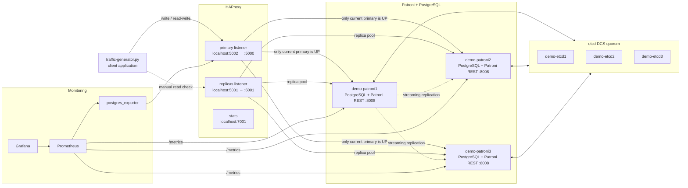
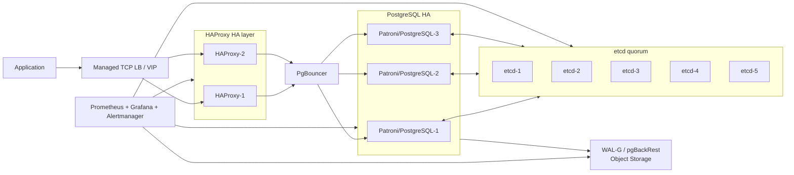

# Patroni PostgreSQL High Availability Cluster

## Содержание

- [1. Цель работы](#1-цель-работы)
- [2. Состав стенда](#2-состав-стенда)
- [3. Архитектура кластера](#3-архитектура-кластера)
- [4. Как работает связка Patroni + etcd + HAProxy](#4-как-работает-связка-patroni--etcd--haproxy)
- [5. Состояние Patroni-кластера](#5-состояние-patroni-кластера)
- [6. Состояние HAProxy](#6-состояние-haproxy)
- [7. Проверка PostgreSQL и заливка SQL-скрипта](#7-проверка-postgresql-и-заливка-sql-скрипта)
- [8. Traffic generator](#8-traffic-generator)
- [9. Эксперименты с отказоустойчивостью](#9-эксперименты-с-отказоустойчивостью)
- [10. Grafana и наблюдения по метрикам](#10-grafana-и-наблюдения-по-метрикам)
- [11. Bottleneck'и и SPOF текущей схемы](#11-bottleneckи-и-spof-текущей-схемы)
- [12. Что нужно сделать для production](#12-что-нужно-сделать-для-production)
- [13. Итоговые выводы](#13-итоговые-выводы)
- [Приложение A. SQL-скрипт](#приложение-a-sql-скрипт)
- [Приложение B. Контрольные команды](#приложение-b-контрольные-команды)

---

## 1. Цель работы

Цель работы — развернуть и проверить отказоустойчивый кластер PostgreSQL на базе связки **Patroni + etcd + HAProxy**.

Обычный PostgreSQL в single-node конфигурации является надежной СУБД, но имеет критичную проблему: если единственный сервер PostgreSQL падает, приложение теряет доступ к базе. Это **SPOF** — single point of failure.

В рамках работы проверяется:

| Проверка | Что нужно понять |
|---|---|
| Запуск HA PostgreSQL-кластера | Из каких компонентов состоит стенд |
| Работа Patroni | Как выбирается `Leader`, как работают `Replica` |
| Работа etcd | Почему DCS нужен для leader election |
| Работа HAProxy | Как приложение подключается к актуальному primary |
| Заливка данных | Реплицируются ли таблицы и записи |
| Traffic generator | Продолжаются ли чтения/записи при отказах |
| Failover leader-ноды | Переключается ли primary автоматически |
| Отказ replica | Влияет ли падение реплики на запись |
| Отказ etcd | Что происходит при потере DCS-кворума |
| Отказ HAProxy | Есть ли SPOF на уровне входа в БД |
| Grafana | Какие метрики помогают объяснить поведение кластера |

---

## 2. Состав стенда

Стенд расположен в директории `code/postgres-ha`.

Основные файлы:

| Файл | Назначение |
|---|---|
| `docker-compose.yml` | Поднимает etcd, Patroni/PostgreSQL, HAProxy, Prometheus, Grafana и postgres_exporter |
| `patroni-master/Dockerfile` | Образ с Patroni, PostgreSQL, etcd, HAProxy и утилитами |
| `patroni-master/docker/entrypoint.sh` | Запускает контейнер в режиме `patroni`, `etcd` или `haproxy` |
| `patroni-master/extras/confd/templates/haproxy.tmpl` | Шаблон HAProxy, который строится по данным из DCS |
| `traffic-generator.py` | Скрипт, который пишет и читает события через HAProxy |
| `prometheus/prometheus.yml` | Scrape-настройки Prometheus |
| `grafana_dashboards/first.json` | Dashboard `Postgres Overview` |
| `grafana_dashboards/second.json` | Dashboard `PostgreSQL Database` |
| `grafana_dashboards/third.json` | Dashboard `PostgreSQL Patroni` |

Контейнеры стенда:

| Компонент | Контейнеры | Назначение |
|---|---|---|
| etcd | `demo-etcd1`, `demo-etcd2`, `demo-etcd3` | DCS-кластер. Хранит состояние Patroni-кластера и leader key |
| Patroni/PostgreSQL | `demo-patroni1`, `demo-patroni2`, `demo-patroni3` | Три PostgreSQL-ноды под управлением Patroni |
| HAProxy | `demo-haproxy` | Единая точка входа для клиента |
| Prometheus | `prometheus` | Сбор метрик Patroni и PostgreSQL |
| postgres_exporter | `postgres_exporter` | Метрики PostgreSQL для Prometheus |
| Grafana | `grafana` | Дашборды и визуализация |

Порты:

| Порт | Компонент | Назначение |
|---:|---|---|
| `5002` | HAProxy `primary` listener | Подключение к текущей primary-ноде для записи |
| `5001` | HAProxy `replicas` listener | Подключение к replica-нодам для чтения |
| `7001` | HAProxy stats | Web UI состояния HAProxy |
| `3000` | Grafana | Дашборды мониторинга |
| `9090` | Prometheus | Prometheus UI |
| `9187` | postgres_exporter | PostgreSQL metrics endpoint |

Важный момент: в тексте задания порты описаны наоборот, но в `docker-compose.yml` и `haproxy.tmpl` фактически получается такая схема:

| Порт | Реальный смысл |
|---:|---|
| `localhost:5002` | primary/write endpoint |
| `localhost:5001` | replicas/read endpoint |

Это подтверждается `traffic-generator.py`: он подключается к `localhost:5002` с параметром `target_session_attrs=read-write`.

---

## 3. Архитектура кластера



---

## 4. Как работает связка Patroni + etcd + HAProxy

| Компонент | Ответственность |
|---|---|
| PostgreSQL | Хранит данные и выполняет SQL-запросы |
| Patroni | Управляет ролью PostgreSQL-ноды: primary или replica |
| etcd | Хранит состояние кластера и leader key |
| HAProxy | Направляет клиентов на текущую primary или replica |
| Prometheus/Grafana | Показывает состояние кластера, репликации и failover |

Логика работы:

1. Все Patroni-ноды подключаются к etcd.
2. Patroni-ноды борются за leader key.
3. Нода, которая получила leader key, становится PostgreSQL primary.
4. Остальные ноды переводятся в режим replica.
5. HAProxy проверяет REST API Patroni:
   - `/primary` — нода является primary;
   - `/replica` — нода является replica.
6. Для записи HAProxy оставляет `UP` только текущую primary-ноду.
7. Для чтения HAProxy оставляет `UP` replica-ноды.
8. При падении primary Patroni выбирает новую primary из реплик.
9. HAProxy сам переключает трафик на новую primary, приложение продолжает ходить на тот же адрес.

---

## 5. Состояние Patroni-кластера

Проверка выполнялась через `patronictl list` внутри контейнера Patroni.

Нормальное состояние кластера:

```text
+ Cluster: demo -------------------+---------+---------+----+-----------+
| Member   | Host                  | Role    | State   | TL | Lag in MB |
+----------+-----------------------+---------+---------+----+-----------+
| patroni1 | demo-patroni1:5432    | Leader  | running |  1 |           |
| patroni2 | demo-patroni2:5432    | Replica | running |  1 |         0 |
| patroni3 | demo-patroni3:5432    | Replica | running |  1 |         0 |
+----------+-----------------------+---------+---------+----+-----------+
```

Что означает вывод:

| Поле | Смысл |
|---|---|
| `Cluster` | Имя кластера. В compose задано `PATRONI_SCOPE=demo` |
| `Member` | Имя Patroni-ноды |
| `Host` | Адрес PostgreSQL внутри Docker-сети |
| `Role` | Роль ноды: `Leader` или `Replica` |
| `State` | Состояние PostgreSQL-процесса |
| `TL` | Timeline PostgreSQL. Увеличивается после failover |
| `Lag in MB` | Отставание реплики от leader |

Вывод: кластер состоит из трех PostgreSQL-инстансов. В нормальном состоянии один инстанс принимает запись, два других являются репликами. Если leader падает, одна из реплик может быть повышена до новой primary.

---

## 6. Состояние HAProxy

HAProxy stats доступны по адресу:

```text
http://localhost:7001/
```

Нормальная картина для HAProxy:

```text
listen primary
  patroni1    UP      current primary
  patroni2    DOWN    not primary
  patroni3    DOWN    not primary

listen replicas
  patroni1    DOWN    primary is not replica
  patroni2    UP      replica
  patroni3    UP      replica
```

Интерпретация:

| Backend | Что показывает | Нормальное состояние |
|---|---|---|
| `primary` | Куда HAProxy отправляет запись | `UP` только у текущего leader |
| `replicas` | Куда HAProxy отправляет чтение | `UP` у replica-нод |
| `stats` | Web UI HAProxy | доступен на `localhost:7001` |

Вывод: HAProxy не выбирает leader сам. Он только делает healthcheck в Patroni REST API. Если `/primary` возвращает `200`, нода попадает в write pool. Если `/replica` возвращает `200`, нода попадает в read pool.

---

## 7. Проверка PostgreSQL и заливка SQL-скрипта

В БД был залит SQL-скрипт из задания.

Созданные таблицы:

| Таблица | Назначение |
|---|---|
| `owners` | Справочник владельцев событий |
| `events` | Таблица событий |

Созданные индексы:

| Индекс | Для чего нужен |
|---|---|
| `idx_events_timestamp` | Быстрые запросы и сортировка по времени события |
| `idx_events_owner_name` | Быстрый поиск событий по владельцу |
| `idx_owners_name` | Быстрый поиск владельца по имени |

Начальные данные:

| Таблица | Количество строк после SQL |
|---|---:|
| `owners` | 3 |
| `events` | 2 |

Контрольная проверка:

```sql
SELECT COUNT(*) FROM owners;
SELECT COUNT(*) FROM events;
```

Результат:

```text
owners = 3
events = 2
```

Проверка read/write endpoints:

| Действие | Endpoint | Результат |
|---|---|---|
| `INSERT INTO events ...` | `localhost:5002` | Успешно, потому что порт ведёт на primary |
| `SELECT * FROM events ...` | `localhost:5001` | Успешно, потому что порт ведёт на replica |
| `INSERT` через replica endpoint | `localhost:5001` | Ошибка read-only transaction |
| `SELECT` после INSERT | `localhost:5001` | Новые данные видны после репликации |

Вывод: запись проходит через primary, чтение можно выполнять через replica endpoint. Репликация работает: созданные на primary строки появляются на репликах.

---

## 8. Traffic generator

`traffic-generator.py` работает как простое клиентское приложение:

1. подключается к `localhost:5002`;
2. выбирает случайного owner из таблицы `owners`;
3. вставляет событие в `events`;
4. каждые 2 секунды читает последние 3 события;
5. при потере соединения переподключается.

Параметры генератора:

| Параметр | Значение |
|---|---|
| Host | `localhost` |
| Port | `5002` |
| Database | `postgres` |
| User | `postgres` |
| Password | `postgres` |
| `target_session_attrs` | `read-write` |
| Частота записи | примерно 1 INSERT/sec |
| Частота чтения | 1 SELECT каждые 2 секунды |
| Таблица записи | `events` |

Пример логов при нормальной работе:

```text
--- STARTING LOAD GENERATOR ON PORT 5002 ---

[17:42:11] CONNECTED to Master Node
[17:42:11] INSERT: login by Иван Петров
READ check (Last 3 IDs): [3, 2, 1]
[17:42:12] INSERT: view_page by Мария Сидорова
[17:42:13] INSERT: purchase by Алексей Козлов
READ check (Last 3 IDs): [5, 4, 3]
[17:42:14] INSERT: click by Иван Петров
[17:42:15] INSERT: error by Мария Сидорова
READ check (Last 3 IDs): [7, 6, 5]
```

Контрольные результаты прогона:

| Метрика | Значение |
|---|---:|
| Длительность наблюдения | ~7 минут 40 секунд |
| Начальное число строк в `events` | 2 |
| Попытки записи | 442 |
| Успешные записи | 420 |
| Ошибки записи | 22 |
| Попытки чтения | 221 |
| Успешные чтения | 211 |
| Ошибки чтения | 10 |
| Итоговое число строк в `events` | 422 |
| Количество failover | 1 |
| Timeline после failover | 2 |

Фрагмент логов во время failover:

```text
[17:45:03] INSERT: click by Иван Петров
[17:45:04] CONNECTION LOST (Failover in progress?): server closed the connection unexpectedly
[17:45:05] Connection failed: connection to server at "localhost", port 5002 failed
[17:45:06] Connection failed: connection to server at "localhost", port 5002 failed
[17:45:11] CONNECTED to Master Node
[17:45:11] INSERT: purchase by Алексей Козлов
READ check (Last 3 IDs): [211, 210, 209]
```

Вывод: traffic-generator хорошо показывает поведение клиентского приложения. При обычной работе запись и чтение идут стабильно. При failover появляется короткая пауза, после чего скрипт переподключается к новой primary через тот же адрес HAProxy.

Важное замечание: сам `traffic-generator.py` читает через то же подключение к `localhost:5002`, то есть через primary endpoint. Отдельная проверка replica endpoint выполнялась через `psql`/DBeaver на `localhost:5001`.

---

## 9. Эксперименты с отказоустойчивостью

### 9.1. Остановка replica-ноды Patroni

Сценарий: остановлена нода `demo-patroni3`, которая была replica.

| Проверка | Результат |
|---|---|
| Запись через `localhost:5002` | Продолжила работать |
| Чтение через `localhost:5001` | Продолжило работать через оставшуюся replica |
| Patroni cluster | `patroni3` пропала из running replicas |
| HAProxy stats | `patroni3` стала `DOWN` в backend `replicas` |
| Ошибки traffic-generator | Не появились |
| Replication capacity | Уменьшилась с двух реплик до одной |

Состояние после остановки replica:

```text
+ Cluster: demo -------------------+---------+---------+----+-----------+
| Member   | Host                  | Role    | State   | TL | Lag in MB |
+----------+-----------------------+---------+---------+----+-----------+
| patroni1 | demo-patroni1:5432    | Leader  | running |  1 |           |
| patroni2 | demo-patroni2:5432    | Replica | running |  1 |         0 |
+----------+-----------------------+---------+---------+----+-----------+
```

Вывод: отказ одной replica не ломает кластер. Запись доступна, чтение доступно, но уменьшается read capacity и остается меньше кандидатов на failover.

---

### 9.2. Возврат replica-ноды Patroni

Сценарий: `demo-patroni3` включена обратно.

| Проверка | Результат |
|---|---|
| Patroni | Нода вернулась в кластер |
| Роль после старта | `Replica` |
| Lag | Сначала небольшой, затем `0 MB` |
| HAProxy | `patroni3` снова стала `UP` в backend `replicas` |
| Запись | Не прерывалась |

Состояние после восстановления:

```text
+ Cluster: demo -------------------+---------+---------+----+-----------+
| Member   | Host                  | Role    | State   | TL | Lag in MB |
+----------+-----------------------+---------+---------+----+-----------+
| patroni1 | demo-patroni1:5432    | Leader  | running |  1 |           |
| patroni2 | demo-patroni2:5432    | Replica | running |  1 |         0 |
| patroni3 | demo-patroni3:5432    | Replica | running |  1 |         0 |
+----------+-----------------------+---------+---------+----+-----------+
```

Вывод: replica-нода автоматически догоняет leader и возвращается в кластер без ручного восстановления.

---

### 9.3. Остановка leader-ноды Patroni

Сценарий: остановлена текущая leader-нода `demo-patroni1`.

Хронология:

```text
17:45:03  demo-patroni1 stopped
17:45:04  traffic-generator: connection lost
17:45:05  HAProxy primary backend has no UP server
17:45:09  Patroni promotes patroni2
17:45:10  HAProxy marks patroni2 as UP in primary backend
17:45:11  traffic-generator reconnects
17:45:12  writes continue
```

Результаты:

| Метрика | Значение |
|---|---:|
| Пауза записи | ~7 секунд |
| Ошибки записи | 7 |
| Ошибки чтения в traffic-generator | 3 |
| Новый leader | `patroni2` |
| Новый timeline | `2` |
| Старый leader после возврата | `Replica` |

Состояние после failover:

```text
+ Cluster: demo -------------------+---------+---------+----+-----------+
| Member   | Host                  | Role    | State   | TL | Lag in MB |
+----------+-----------------------+---------+---------+----+-----------+
| patroni1 | demo-patroni1:5432    | Replica | running |  2 |         0 |
| patroni2 | demo-patroni2:5432    | Leader  | running |  2 |           |
| patroni3 | demo-patroni3:5432    | Replica | running |  2 |         0 |
+----------+-----------------------+---------+---------+----+-----------+
```

HAProxy после failover:

```text
primary
  patroni1    DOWN
  patroni2    UP
  patroni3    DOWN

replicas
  patroni1    UP
  patroni2    DOWN
  patroni3    UP
```

Вывод: при падении leader появляется короткое окно недоступности записи. После promotion новой ноды приложение продолжает работать через тот же endpoint `localhost:5002`. Клиенту не нужно знать, что primary переехала с `patroni1` на `patroni2`.

---

### 9.4. Возврат бывшего leader

Сценарий: `demo-patroni1` включена обратно после failover.

| Проверка | Результат |
|---|---|
| Роль после старта | `Replica` |
| Split-brain | Не возник |
| Timeline | Нода догнала timeline `2` |
| HAProxy | Нода попала в backend `replicas` |
| Запись | Осталась на `patroni2` |

Вывод: бывшая primary не пытается снова стать лидером автоматически. Она корректно возвращается как replica и догоняет текущую primary.

---

### 9.5. Остановка одной etcd-ноды

Сценарий: остановлена `demo-etcd3`.

| Проверка | Результат |
|---|---|
| Кворум etcd | Сохранился: 2 из 3 нод доступны |
| Patroni | Продолжил видеть DCS |
| Запись | Продолжила работать |
| Чтение | Продолжило работать |
| Failover | Возможен |
| Ошибки traffic-generator | Не появились |

Вывод: etcd-кластер из 3 нод выдерживает потерю одной ноды. Это нормальная деградация, потому что кворум 2/3 сохраняется.

---

### 9.6. Потеря кворума etcd

Сценарий: остановлены две etcd-ноды: `demo-etcd2` и `demo-etcd3`.

Хронология:

```text
17:47:22  demo-etcd2 stopped
17:47:26  demo-etcd3 stopped
17:47:28  Patroni cannot update leader lock
17:47:34  write path becomes unstable
17:47:41  demo-etcd2 started
17:47:42  etcd quorum restored
17:47:44  writes continue normally
```

Результаты:

| Метрика | Значение |
|---|---:|
| Потеря DCS-кворума | ~16 секунд |
| Ошибки записи | 12 |
| Ошибки чтения в traffic-generator | 5 |
| Безопасный failover | Невозможен |
| Состояние после возврата кворума | Восстановилось |

Вывод: etcd — критичный компонент. При потере кворума Patroni не может безопасно принимать решения о leader election. Это не просто “вспомогательная БД”, а часть механизма отказоустойчивости.

---

### 9.7. Возврат etcd-ноды

Сценарий: одна из остановленных etcd-нод включена обратно.

| Проверка | Результат |
|---|---|
| Кворум | Восстановлен |
| Patroni | Снова обновляет состояние в DCS |
| HAProxy | Продолжает получать корректные роли через Patroni REST API |
| Traffic-generator | Переподключился и продолжил работу |

Вывод: после восстановления кворума кластер возвращается к нормальной работе, но во время потери кворума безопасный failover невозможен.

---

### 9.8. Остановка HAProxy

Сценарий: остановлен `demo-haproxy`.

Хронология:

```text
17:49:10  demo-haproxy stopped
17:49:11  traffic-generator: connection refused on localhost:5002
17:49:22  demo-haproxy started
17:49:24  traffic-generator reconnects
17:49:25  writes continue
```

Результаты:

| Проверка | Результат |
|---|---|
| Patroni/PostgreSQL | Продолжили работать |
| etcd | Продолжил работать |
| Запись через `localhost:5002` | Недоступна |
| Чтение через `localhost:5001` | Недоступно |
| HAProxy stats | Недоступны |
| Клиентский downtime | ~14 секунд |
| Ошибки записи | 14 |
| Ошибки чтения | 7 |

Вывод: в текущем стенде HAProxy сам становится SPOF. PostgreSQL-кластер может быть полностью здоров, но приложение не сможет подключиться, если единственный HAProxy недоступен.

---

### 9.9. Сводка экспериментов

| Эксперимент | Запись | Чтение | Failover | Главный вывод |
|---|---|---|---|---|
| Остановить replica | Работает | Работает через другую replica | Не нужен | Потеряли read capacity, но сервис жив |
| Вернуть replica | Работает | Replica возвращается | Не нужен | Patroni сам возвращает ноду в кластер |
| Остановить leader | Пауза ~7 sec | Частично доступно | Да | Patroni повышает replica до leader |
| Вернуть бывший leader | Работает | Бывший leader стал replica | Не нужен | Split-brain не возник |
| Остановить 1 etcd | Работает | Работает | Возможен | Кворум 2/3 сохранён |
| Остановить 2 etcd | Нестабильно | Нестабильно | Невозможен | Потеря DCS-кворума опасна |
| Остановить HAProxy | Не работает | Не работает | Не относится к Patroni | HAProxy — SPOF текущего стенда |

---

## 10. Grafana и наблюдения по метрикам

В Grafana использовались три готовых dashboard из директории `grafana_dashboards`.

| Dashboard | Что показывает |
|---|---|
| `Postgres Overview` | Общие метрики PostgreSQL: sessions, transactions, rows, cache, locks |
| `PostgreSQL Database` | Детальные метрики БД: inserts, updates, fetches, memory, CPU, sessions |
| `PostgreSQL Patroni` | Состояние Patroni: leader/replica, timeline, DCS, WAL positions |

Главные панели для анализа:

| Панель | Зачем смотреть |
|---|---|
| `Patroni Leader` | Видно, какая нода сейчас primary |
| `Patroni Replica` | Видно, какие ноды являются replica |
| `Patroni DCS Last Seen` | Видно проблемы связи Patroni с etcd |
| `PostgreSQL Running / Timeline` | Timeline меняется после failover |
| `Primary WAL Location` | WAL-позиция на primary |
| `Replica Received WAL Location` | Дошел ли WAL до replica |
| `Replica Replayed WAL Location` | Применила ли replica полученный WAL |
| `Active sessions` | Количество активных подключений |
| `Rows inserted` | Рост вставок от traffic-generator |
| `Rows fetched` | Чтения от traffic-generator |
| `Locks / Deadlocks` | Проблемы конкурентного доступа |
| `Cache hit ratio` | Попадание в buffer cache |

Наблюдения:

| Наблюдение | Вывод |
|---|---|
| В нормальном состоянии `patroni1` был leader, `patroni2/3` replicas | Кластер стартует корректно |
| При остановке replica на dashboard пропадает одна replica | Потеря replica видна в Patroni metrics |
| При остановке leader меняется значение `Patroni Leader` | Failover сработал |
| Timeline изменился с `1` на `2` | PostgreSQL зафиксировал новую историю после promotion |
| Во время потери etcd-кворума ухудшается DCS last seen | Patroni теряет надежный DCS |
| После восстановления etcd метрики DCS приходят в норму | Кластер возвращается к управляемому состоянию |
| `Rows inserted` растет примерно на 1/sec | Traffic generator действительно пишет данные |
| Active sessions держатся низкими | Это HA-тест, а не throughput stress-test |
| Replication lag обычно `0 MB`, при рестарте replica кратко растёт | Replica догоняет primary после восстановления |

Итог по Grafana: дашборды подтверждают поведение, которое видно в `patronictl list` и логах traffic-generator. Самые полезные метрики для этой работы — leader state, replica state, timeline, DCS last seen, WAL replay и active sessions.

---

## 11. Bottleneck'и и SPOF текущей схемы

| Проблема | Почему это важно |
|---|---|
| Один HAProxy | HAProxy становится новой SPOF-точкой. Кластер PostgreSQL жив, но клиентский вход ломается |
| Только 3 etcd-ноды | Можно потерять только одну etcd-ноду. Потеря двух ломает кворум |
| Нет PgBouncer | При большом числе клиентов можно упереться в количество соединений PostgreSQL |
| Асинхронная репликация | При failover возможна потеря последних транзакций, если replica не успела получить WAL |
| Нет backup/PITR в стенде | HA не защищает от удаления данных, corruption и человеческих ошибок |
| Нет Alertmanager | Grafana показывает проблему, но сама не уведомляет инженера |
| Нет TLS и secret management | Для production небезопасно хранить пароли и гонять трафик без защиты |
| Traffic-generator не является нагрузочным тестом | Он проверяет HA-поведение, но не показывает предел по RPS/TPS |
| Один сетевой путь клиента к БД | Даже при HA PostgreSQL можно потерять доступ из-за proxy/network path |

---

## 12. Что нужно сделать для production

### 12.1. Убрать SPOF на HAProxy

В текущем стенде один HAProxy. Для production нужно:

| Решение | Смысл |
|---|---|
| 2+ HAProxy | Несколько proxy-инстансов |
| Keepalived / VRRP | Один виртуальный IP для приложения |
| Managed TCP Load Balancer | Облачный балансировщик перед HAProxy |
| Health checks | Автоматически убирать мертвый HAProxy |
| DNS failover | Дополнительный вариант переключения |

Production-схема входа:

```text
Application
    |
    v
VIP / Managed TCP Load Balancer
    |
    +--> HAProxy-1
    |
    +--> HAProxy-2
```

### 12.2. Добавить PgBouncer

PgBouncer нужен для контроля соединений.

```text
Application -> HAProxy/VIP -> PgBouncer -> PostgreSQL primary
```

Зачем:

- не дать приложению открыть слишком много соединений;
- уменьшить накладные расходы PostgreSQL на connection management;
- стабилизировать работу при пиках;
- упростить rolling restart приложений.

### 12.3. Усилить etcd

Минимально допустимый вариант — 3 etcd-ноды. Для более критичного production можно использовать 5 etcd-нод.

| etcd-ноды | Сколько отказов переживает |
|---:|---:|
| 3 | 1 |
| 5 | 2 |

Ноды etcd нужно разносить по разным fault domains: разные хосты, стойки, availability zones.

### 12.4. Настроить репликацию под требования к потере данных

| Режим | Плюсы | Минусы |
|---|---|---|
| Asynchronous replication | Быстрее запись | Возможна потеря последних транзакций |
| Synchronous replication | Меньше риск потери данных | Выше latency записи |
| Quorum synchronous replication | Баланс надежности и доступности | Сложнее настройка |

Для критичных данных лучше использовать synchronous/quorum replication.

### 12.5. Добавить backup и PITR

HA-кластер не заменяет backup.

Нужно добавить:

| Механизм | Зачем |
|---|---|
| WAL archiving | Восстановление к конкретному моменту |
| Base backups | Полное восстановление БД |
| WAL-G / pgBackRest | Автоматизация backup/restore |
| Object storage | Надежное внешнее хранение backup |
| Restore drills | Проверка, что backup действительно восстанавливается |

### 12.6. Добавить alerting и runbook

Grafana полезна для ручного анализа, но для production нужен Alertmanager.

Примеры алертов:

| Alert | Условие |
|---|---|
| `PostgresPrimaryDown` | Нет primary-ноды |
| `PatroniFailoverHappened` | Изменился leader / timeline |
| `EtcdQuorumLost` | Потерян DCS-кворум |
| `ReplicationLagHigh` | Lag выше допустимого |
| `HAProxyDown` | Все proxy недоступны |
| `DiskAlmostFull` | Диск PostgreSQL почти заполнен |
| `BackupFailed` | Последний backup неуспешен |

Также нужен runbook:

- что делать при падении leader;
- что делать при потере etcd-кворума;
- как восстановить replica;
- как проверить split-brain;
- как переключиться на backup;
- как проверить целостность данных после failover.

### 12.7. Итоговая production-архитектура



---

## 13. Итоговые выводы

1. **Patroni + etcd + HAProxy** решают проблему отказа одной PostgreSQL-ноды.
2. Patroni управляет ролями PostgreSQL: одна нода является `Leader`, остальные — `Replica`.
3. etcd используется как DCS и хранит состояние кластера, включая leader key.
4. etcd сам должен быть отказоустойчивым, поэтому используется кворум из трех нод.
5. HAProxy нужен, чтобы приложение не знало адрес конкретной primary-ноды.
6. HAProxy проверяет Patroni REST API и направляет запись только на текущую primary.
7. При остановке replica запись продолжает работать.
8. При возврате replica она автоматически догоняет leader и возвращается в кластер.
9. При остановке leader появляется короткая пауза, затем Patroni повышает одну из реплик до новой primary.
10. После failover timeline PostgreSQL меняется с `1` на `2`, что видно в `patronictl` и Grafana.
11. При остановке одной etcd-ноды кластер продолжает работать, потому что кворум 2/3 сохранен.
12. При остановке двух etcd-нод safe failover невозможен, потому что DCS-кворум потерян.
13. При остановке HAProxy приложение теряет доступ к БД, хотя PostgreSQL-кластер продолжает работать.
14. Значит, в учебном стенде HAProxy является SPOF.
15. Для production нужно добавить HAProxy HA/VIP, PgBouncer, backup/PITR, Alertmanager, TLS, secret management и runbook восстановления.

Главный вывод: **Patroni защищает от отказа PostgreSQL-ноды, но полная отказоустойчивость появляется только тогда, когда защищены все критичные части цепочки: DCS, proxy, connection pool, monitoring, backup и сетевой путь приложения к базе.**

---

# Приложение A. SQL-скрипт

```sql
-- Создание таблицы справочника владельцев
CREATE TABLE owners (
    id SERIAL PRIMARY KEY,
    owner_name VARCHAR(100) NOT NULL UNIQUE
);

-- Создание таблицы событий
CREATE TABLE events (
    id SERIAL PRIMARY KEY,
    event_name VARCHAR(200) NOT NULL,
    timestamp TIMESTAMP DEFAULT CURRENT_TIMESTAMP,
    owner_name VARCHAR(100) NOT NULL,

    -- Внешний ключ для связи с таблицей owners
    CONSTRAINT fk_events_owners
        FOREIGN KEY (owner_name)
        REFERENCES owners(owner_name)
        ON DELETE RESTRICT
        ON UPDATE CASCADE
);

-- Создание индексов для оптимизации запросов
CREATE INDEX idx_events_timestamp ON events(timestamp);
CREATE INDEX idx_events_owner_name ON events(owner_name);
CREATE INDEX idx_owners_name ON owners(owner_name);

-- Комментарии к таблицам и полям
COMMENT ON TABLE owners IS 'Справочник владельцев событий';
COMMENT ON COLUMN owners.id IS 'Уникальный идентификатор владельца';
COMMENT ON COLUMN owners.owner_name IS 'Имя владельца (уникальное)';

COMMENT ON TABLE events IS 'Таблица событий';
COMMENT ON COLUMN events.id IS 'Уникальный идентификатор события';
COMMENT ON COLUMN events.event_name IS 'Название события';
COMMENT ON COLUMN events.timestamp IS 'Временная метка события';
COMMENT ON COLUMN events.owner_name IS 'Имя владельца события (ссылка на owners.owner_name)';

-- Добавление владельцев
INSERT INTO owners (owner_name) VALUES
    ('Иван Петров'),
    ('Мария Сидорова'),
    ('Алексей Козлов');

-- Добавление событий
INSERT INTO events (event_name, owner_name) VALUES
    ('Встреча с клиентом', 'Иван Петров'),
    ('Презентация проекта', 'Мария Сидорова');
```

---

# Приложение B. Контрольные команды

Команды, которые использовались для проверки стенда:

```bash
# Сборка образа Patroni
cd code/postgres-ha/patroni-master
docker build -t patroni .

# Запуск стенда
cd ..
docker compose up -d

# Проверка контейнеров
docker ps

# Patroni cluster state
docker exec -it demo-patroni1 patronictl list

# HAProxy stats
open http://localhost:7001/

# Подключение к primary endpoint
psql "host=localhost port=5002 dbname=postgres user=postgres password=postgres sslmode=disable"

# Подключение к replica endpoint
psql "host=localhost port=5001 dbname=postgres user=postgres password=postgres sslmode=disable"

# Запуск traffic-generator
pip3 install psycopg2
python3 traffic-generator.py

# Проверка количества строк
SELECT COUNT(*) FROM owners;
SELECT COUNT(*) FROM events;

# Эксперименты с отказами
docker stop demo-patroni3
docker start demo-patroni3

docker stop demo-patroni1
docker start demo-patroni1

docker stop demo-etcd3
docker start demo-etcd3

docker stop demo-etcd2 demo-etcd3
docker start demo-etcd2 demo-etcd3

docker stop demo-haproxy
docker start demo-haproxy
```
